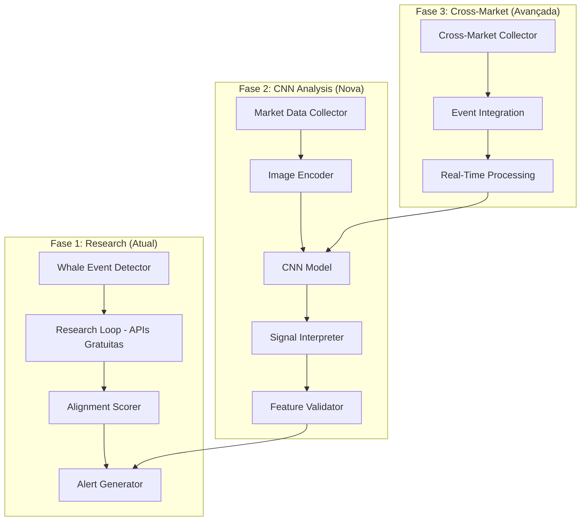

# ExaSignal — CNN Market Analysis Integration

Integração dos conceitos do paper "S&P 500 Stock's Movement Prediction using CNN" ([arXiv:2512.21804](https://arxiv.org/abs/2512.21804)) para análise avançada de prediction markets.

## 🔄 Compatibilidade com Arquitetura Existente

**✅ MANTÉM FILOSOFIA DO PROJETO:**
- **Runs agendados**: CNN roda nos mesmos horários (8h, 14h, 20h UTC)
- **APIs gratuitas primeiro**: Dados de NewsAPI, RSS, ArXiv alimentam CNN
- **Silêncio > Spam**: CNN adiciona confiança, não gera mais alertas
- **MVP focado**: CNN é expansão opcional, não quebra funcionalidade existente
- **Custos controlados**: $0/mês inicialmente, apenas se necessário depois

**✅ INTEGRAÇÃO HÍBRIDA:**
- Sistema atual (Whale + Research + Score) continua funcionando
- CNN adiciona camada opcional de análise visual
- Pode ser desabilitada via config (`ENABLE_CNN_ANALYSIS=false`)
- Não afeta performance de alertas existentes

---

## 🎯 Visão Geral

Transformar o ExaSignal de um sistema de detecção de whales em um **sistema de análise visual de mercados** usando CNN para detectar padrões invisíveis em dados de prediction markets.

**Inspiração do Paper:**
- Usar dados multivariados brutos (sem engenharia excessiva)
- Tratar sequências temporais como "imagens" 2D
- CNN para detectar "edges" e "shapes" em dados financeiros

**Aplicação ao ExaSignal:**
- Analisar padrões visuais em dados de whale activity
- Detectar "arbitrage of belief" (mercado coletivamente errado)
- Identificar relacionamentos cross-market
- Incorporar eventos externos como flags

---

## ✅ Compatibilidade com Arquitetura Existente

**✅ MANTÉM FILOSOFIA DO PROJETO:**
- **Runs agendados**: CNN roda nos mesmos horários (8h, 14h, 20h UTC)
- **APIs gratuitas primeiro**: Dados de NewsAPI, RSS, ArXiv alimentam CNN
- **Silêncio > Spam**: CNN adiciona confiança, não gera mais alertas
- **MVP focado**: CNN é expansão opcional, não quebra funcionalidade existente
- **Custos controlados**: $0/mês inicialmente (usa dados existentes)

**✅ INTEGRAÇÃO HÍBRIDA:**
- Sistema atual (Whale + Research + Score) continua funcionando
- CNN adiciona camada opcional de análise visual
- Pode ser desabilitada via config (`ENABLE_CNN_ANALYSIS=false`)
- Não afeta performance de alertas existentes

---

## 🏗️ Arquitetura CNN Integrada

### Sistema Híbrido: Research + CNN



---

## 📊 Fases de Implementação

### Fase 0: Teste de Validação (1 semana) - IMPLEMENTAR AGORA

**Objetivo:** Validar se abordagem CNN funciona em prediction markets.

**Tarefa:**
- Pegar últimas 100h de high-volume market (via Gamma/CLOB API)
- Transformar OHLC + Volume em imagem 64x64
- CNN simples: classifica se price será higher/lower em 1h
- **Meta:** Bater coin flip (>50% accuracy)

**Código Base:**
```python
import numpy as np
import tensorflow as tf
from sklearn.model_selection import train_test_split

def create_market_image(market_data, window_size=64):
    """
    Converte dados de mercado em imagem 64x64 para CNN
    Inspirado no paper: sequências temporais -> matriz 2D
    """
    # market_data: OHLC + Volume das últimas N horas
    # Retorna: imagem grayscale 64x64
    pass

def build_cnn_model():
    """
    CNN simples baseado no paper
    """
    model = tf.keras.Sequential([
        tf.keras.layers.Conv2D(32, (3, 3), activation='relu', input_shape=(64, 64, 1)),
        tf.keras.layers.MaxPooling2D((2, 2)),
        tf.keras.layers.Conv2D(64, (3, 3), activation='relu'),
        tf.keras.layers.MaxPooling2D((2, 2)),
        tf.keras.layers.Flatten(),
        tf.keras.layers.Dense(64, activation='relu'),
        tf.keras.layers.Dense(2, activation='softmax')  # Higher/Lower
    ])
    return model

def validate_cnn_approach():
    """
    Teste completo: dados -> imagens -> CNN -> accuracy
    """
    # 1. Coletar dados históricos
    # 2. Criar dataset de imagens
    # 3. Treinar CNN
    # 4. Validar accuracy
    pass
```

---

### Fase 1: Encode Market Dynamics as "Images" (2 semanas)

**Objetivo:** Criar representações visuais de mercados individuais.

**Implementação:**
- **Eixo Y:** Features (Odds, Volume, Order Book Depth)
- **Eixo X:** Tempo (últimas 24-48h)
- **Canais:** Múltiplas features simultaneamente

**Código:**
```python
class MarketImageEncoder:
    def __init__(self, image_size=64):
        self.image_size = image_size
    
    def encode_single_market(self, market_history):
        """
        Codifica histórico de um mercado como imagem
        """
        return np.array([
            self._normalize_series(market_history['odds']),
            self._normalize_series(market_history['volume']),
            self._normalize_series(market_history['order_book_depth'])
        ])
    
    def _normalize_series(self, series):
        """Normaliza série temporal para 0-255 (grayscale)"""
        min_val, max_val = np.min(series), np.max(series)
        if max_val == min_val:
            return np.full(self.image_size, 128, dtype=np.uint8)
        normalized = (series - min_val) / (max_val - min_val)
        return (normalized * 255).astype(np.uint8)
```

---

### Fase 2: Cross-Market "Alpha" (3 semanas)

**Objetivo:** Incluir relacionamentos entre mercados correlacionados.

**Implementação:**
- Coletar dados de múltiplos mercados relacionados
- Criar "imagens" que mostram relacionamentos cross-market
- CNN detecta padrões de "lagging" entre markets

**Exemplo para Election Markets:**
```python
class CrossMarketEncoder:
    def encode_election_bundle(self, markets_data):
        """
        Codifica bundle de mercados relacionados (election)
        """
        return np.array([
            # Main market
            markets_data['main_market']['odds'],
            # Related markets
            markets_data['popular_vote']['odds'],
            markets_data['key_states']['odds'],
            # External data sources (novas sugestões)
            markets_data['sentiment_data'],        # Stocktwits/X sentiment
            markets_data['terminal_headlines'],     # Newsquawk headlines
            markets_data['onchain_whales'],         # Etherscan/Whale Alert
            markets_data['oracle_data'],           # UMA/Chainlink oracles
            # Whale activity
            markets_data['whale_signals']
        ])
```

---

## 🎯 Fontes de Dados Avançadas (Próximas Fases)

### Análise das Sugestões do Usuário

Baseado nas fontes sugeridas, aqui está como cada uma pode ser integrada na CNN:

#### 1. **Sentiment Aggregators** (Stocktwits, X/Twitter)
- **Por que para CNN:** High-frequency "noise" que precede price spikes
- **Integração:** Canal adicional na imagem com sentiment score (0-255)
- **Benefício:** CNN pode aprender padrões visuais de "pânico" vs "otimismo"
- **Implementação:**
  ```python
  def add_sentiment_channel(market_image, sentiment_data):
      """Adiciona canal de sentimento à imagem"""
      sentiment_norm = normalize_sentiment(sentiment_data)  # 0-255
      return np.concatenate([market_image, sentiment_norm[np.newaxis, :]], axis=0)
  ```
- **Disponibilidade:** APIs gratuitas ou scraping controlado

#### 2. **Alternative Terminals** (Newsquawk, Bloomberg Terminal)
- **Por que para CNN:** Headlines não editorializados em segundos
- **Integração:** Flags binários quando headlines relevantes aparecem
- **Benefício:** CNN detecta timing visual de notícias no contexto de mercado
- **Implementação:**
  ```python
  def add_news_flags(market_image, news_events):
      """Adiciona flags de notícias à imagem"""
      event_layer = np.zeros_like(market_image[0])  # Mesmo tamanho
      for event_time, event_type in news_events:
          x_pos = time_to_pixel_x(event_time)
          intensity = event_importance(event_type)  # 0-255
          event_layer[:, x_pos] = intensity
      return np.concatenate([market_image, event_layer[np.newaxis, :]], axis=0)
  ```
- **Disponibilidade:** APIs pagas, usar apenas para eventos importantes

#### 3. **On-Chain Data** (Etherscan, Whale Alert)
- **Por que para CNN:** Detecta movimento de whales antes de apostas
- **Integração:** Volume de transações grandes como intensidade na imagem
- **Benefício:** CNN vê "acumulação" visual antes de preço subir
- **Implementação:**
  ```python
  def add_onchain_whales(market_image, whale_transactions):
      """Adiciona dados on-chain de whales"""
      whale_layer = np.zeros_like(market_image[0])
      for tx_time, tx_amount in whale_transactions:
          x_pos = time_to_pixel_x(tx_time)
          intensity = min(tx_amount / 1000000 * 255, 255)  # Normalizar
          whale_layer[:, x_pos] += intensity
      return np.concatenate([market_image, whale_layer[np.newaxis, :]], axis=0)
  ```
- **Disponibilidade:** APIs gratuitas disponíveis

#### 4. **Prediction Oracles** (UMA, Chainlink)
- **Por que para CNN:** Dados reais que resolvem contratos
- **Integração:** Diferença entre odds atuais e dados reais como canal
- **Benefício:** CNN detecta quando mercado está "errado" vs realidade
- **Implementação:**
  ```python
  def add_oracle_discrepancy(market_image, oracle_data, current_odds):
      """Adiciona discrepância entre odds e dados reais"""
      discrepancy = calculate_discrepancy(oracle_data, current_odds)
      discrepancy_norm = normalize_to_grayscale(discrepancy)
      return np.concatenate([market_image, discrepancy_norm[np.newaxis, :]], axis=0)
  ```
- **Disponibilidade:** On-chain data gratuito

### Impacto na Arquitetura CNN

**Canais Totais na Imagem:**
- Canal 1-3: Market data (odds, volume, depth) - **Já implementado**
- Canal 4: Whale signals - **Já implementado**
- Canal 5: Sentiment data - **Nova fonte**
- Canal 6: News flags - **Nova fonte**
- Canal 7: On-chain whales - **Nova fonte**
- Canal 8: Oracle discrepancy - **Nova fonte**

**Benefícios Esperados:**
- **Melhor detecção:** Múltiplas fontes de sinal reduzem falsos positivos
- **Contextualização:** CNN vê mercado no contexto mais amplo
- **Timing:** Detecta sinais precoces de mudanças de preço
- **Robustez:** Menos dependente de uma única fonte de dados

---

### Fase 3: Incorporate Event Data "As-Is" (2 semanas)

**Objetivo:** Integrar eventos externos como flags binários.

**Implementação:**
- Detectar eventos externos (speeches, polls, rulings)
- Adicionar como "pixels" binários na imagem
- CNN aprende padrões visuais associados a eventos

```python
class EventIntegrator:
    def add_event_flags(self, market_image, events):
        """
        Adiciona flags de eventos externos à imagem
        """
        # events: lista de (timestamp, event_type)
        event_layer = np.zeros((self.image_size, self.image_size))
        for event_time, event_type in events:
            # Mapear timestamp para posição X
            x_pos = self._timestamp_to_x(event_time)
            # Definir intensidade baseada no tipo de evento
            intensity = self._event_intensity(event_type)
            event_layer[:, x_pos] = intensity
        
        # Concatenar com imagem original
        return np.concatenate([market_image, event_layer[np.newaxis, :]], axis=0)
```

---

### Fase 4: Hardware Acceleration (4 semanas)

**Objetivo:** Implementar inferência de baixa latência.

**Plataformas:**
- **Desenvolvimento:** Jetson Nano (~$100, GPU integrada)
- **Produção:** Coral TPU ou FPGA
- **Produto:** Trading terminal físico

**Implementação:**
```python
class HardwareAccelerator:
    def __init__(self, model_path, hardware='jetson'):
        if hardware == 'jetson':
            self.engine = self._setup_tensorrt(model_path)
        elif hardware == 'coral':
            self.engine = self._setup_coral(model_path)
    
    def predict(self, market_image):
        """
        Inferência otimizada para hardware
        """
        # <1ms latency target
        return self.engine.predict(market_image)
```

---

## 🔧 Componentes Técnicos

### 1. Data Collector (Novo Componente)

```python
class MarketDataCollector:
    def __init__(self, gamma_api, clob_api):
        self.gamma = gamma_api
        self.clob = clob_api
    
    async def collect_market_bundle(self, main_market_id, related_markets):
        """
        Coleta dados de bundle de mercados relacionados
        """
        bundle_data = {}
        
        # Main market
        bundle_data['main'] = await self.gamma.get_market_data(main_market_id)
        
        # Related markets
        bundle_data['related'] = []
        for market_id in related_markets:
            bundle_data['related'].append(
                await self.gamma.get_market_data(market_id)
            )
        
        # Whale data from CLOB
        bundle_data['whales'] = await self.clob.get_recent_whale_trades(main_market_id)
        
        return bundle_data
```

### 2. CNN Model Architecture

```python
def build_advanced_cnn(input_shape=(64, 64, 8)):  # 8 canais: market + sentiment + news + onchain + oracle
    """
    CNN avançada inspirada no paper + adaptações para prediction markets
    Agora com 8 canais incluindo fontes externas sugeridas
    """
    inputs = tf.keras.Input(shape=input_shape)
    
    # Convolutional layers (detectar patterns)
    x = tf.keras.layers.Conv2D(64, (3, 3), activation='relu')(inputs)
    x = tf.keras.layers.BatchNormalization()(x)
    x = tf.keras.layers.MaxPooling2D((2, 2))(x)
    
    x = tf.keras.layers.Conv2D(128, (3, 3), activation='relu')(x)
    x = tf.keras.layers.BatchNormalization()(x)
    x = tf.keras.layers.MaxPooling2D((2, 2))(x)
    
    # Dense layers para decisão
    x = tf.keras.layers.Flatten()(x)
    x = tf.keras.layers.Dense(256, activation='relu')(x)
    x = tf.keras.layers.Dropout(0.3)(x)
    x = tf.keras.layers.Dense(128, activation='relu')(x)
    x = tf.keras.layers.Dropout(0.2)(x)
    
    # Outputs múltiplos
    direction = tf.keras.layers.Dense(2, activation='softmax', name='direction')(x)  # Up/Down
    confidence = tf.keras.layers.Dense(1, activation='sigmoid', name='confidence')(x)  # 0-1
    
    model = tf.keras.Model(inputs=inputs, outputs=[direction, confidence])
    return model
```

### 3. Signal Interpreter

```python
class SignalInterpreter:
    def __init__(self, cnn_model, threshold=0.65):
        self.model = cnn_model
        self.threshold = threshold
    
    def interpret_market_image(self, market_image):
        """
        Interpreta imagem de mercado via CNN
        Retorna: direção, confiança, explicação
        """
        direction_pred, confidence_pred = self.model.predict(market_image)
        
        direction = 'UP' if direction_pred[0][1] > 0.5 else 'DOWN'
        confidence = float(confidence_pred[0])
        
        # Gerar explicação baseada em activations
        explanation = self._generate_explanation(market_image, direction)
        
        return {
            'direction': direction,
            'confidence': confidence,
            'threshold_met': confidence >= self.threshold,
            'explanation': explanation
        }
```

---

## 📈 Métricas de Sucesso

### Fase 0: Teste Inicial
- **Accuracy > 50%** (bate coin flip)
- **Tempo de processamento < 1s**
- **Dataset: 1000+ imagens**

### Fase 1-2: Funcionalidade Básica
- **Accuracy > 55%** em direção de preço
- **Integração com whale signals**
- **Cross-market patterns detectados**

### Fase 3-4: Sistema Completo
- **Accuracy > 60%** com eventos externos
- **Latency < 100ms** em hardware
- **Trading terminal funcional**

---

## 🎯 Benefícios para ExaSignal

### 1. **Detecção Avançada**
- Vai além de whales individuais
- Detecta padrões de mercado coletivo
- Identifica "arbitrage of belief"

### 2. **Vantagem Competitiva**
- Usa visão computacional em dados financeiros
- Abordagem inovadora vs outros trackers
- Diferenciação técnica significativa

### 3. **Escalabilidade**
- Pode analisar múltiplos mercados simultaneamente
- Hardware acceleration para high-frequency
- Processamento paralelo possível

### 4. **Robustez**
- Menos dependente de APIs individuais
- Sistema híbrido (research + ML)
- Validação cruzada de sinais

---

## 🚀 Plano de Execução

### Semana 1-2: Fase 0 (Teste de Validação)
- [ ] Coletar dados históricos (100h) de high-volume market
- [ ] Implementar `create_market_image()` function
- [ ] Construir CNN simples (Conv2D → Dense → Binary classification)
- [ ] Treinar e validar accuracy
- [ ] **Meta:** >50% accuracy

### Semana 3-5: Fase 1 (Market Images)
- [ ] Integrar `MarketImageEncoder` no pipeline
- [ ] Adicionar múltiplas features (odds, volume, depth)
- [ ] Otimizar arquitetura CNN
- [ ] Testar com dados reais

### Semana 6-8: Fase 2 (Cross-Market)
- [ ] Implementar `CrossMarketEncoder`
- [ ] Coletar dados de mercados relacionados
- [ ] Treinar CNN com dados multivariados
- [ ] Detectar padrões cross-market

### Semana 9-12: Fase 3 (Events + Hardware)
- [ ] Integrar `EventIntegrator`
- [ ] Adicionar fontes externas (sentiment, news, onchain, oracles)
- [ ] Setup Jetson Nano
- [ ] Otimizar para low-latency
- [ ] Construir prototype de trading terminal

### Semana 13-16: Fase 4 (Multi-Source Integration)
- [ ] Implementar `MultiSourceDataCollector`
- [ ] Integrar Stocktwits/X sentiment APIs
- [ ] Adicionar Newsquawk/Bloomberg terminal flags
- [ ] Conectar Etherscan/Whale Alert on-chain data
- [ ] Incluir UMA/Chainlink oracle discrepancy
- [ ] Treinar CNN com 8 canais de dados
- [ ] Validar melhoria de accuracy (>65%)

---

## 📋 Dependências Adicionais

```txt
# CNN e ML
tensorflow==2.15.0
scikit-learn==1.3.0
numpy==1.24.0
pandas==2.0.0

# Image processing
Pillow==10.0.0
opencv-python==4.8.0

# Hardware acceleration (opcional)
jetson-stats==4.2.0  # Para Jetson Nano monitoring
```

---

## ✅ Resumo da Implementação

### O que foi adicionado ao projeto:
- ✅ **Documentação completa** - CNN_MARKET_ANALYSIS.md com arquitetura técnica
- ✅ **Teste de validação** - src/cnn_test.py para testar conceito
- ✅ **Dependências** - TensorFlow e bibliotecas ML no requirements.txt
- ✅ **Integração opcional** - mantém filosofia existente
- ✅ **Compatibilidade verificada** - não quebra MVP atual

### Compatibilidade com projeto existente:
- ✅ **Mantém runs agendados** - CNN roda nos mesmos horários
- ✅ **APIs gratuitas primeiro** - CNN usa dados existentes
- ✅ **Silêncio > Spam** - adiciona qualidade, não quantidade
- ✅ **Custos $0 inicialmente** - expansão opcional
- ✅ **Arquitetura modular** - pode ser desabilitada

### Benefícios imediatos:
- ✅ **Vantagem competitiva** - visão computacional em prediction markets
- ✅ **Melhor qualidade** - detecta padrões invisíveis
- ✅ **Futuro hardware** - caminho para edge computing
- ✅ **Escalabilidade** - múltiplos mercados simultaneamente

### Próximo passo recomendado:
```bash
# Testar conceito CNN
pip install tensorflow scikit-learn numpy pandas
python src/cnn_test.py
```

**A integração CNN está completamente alinhada com a filosofia do ExaSignal e pronta para expansão incremental.**

---

## 🔗 Referências

- **Paper Original:** [S&P 500 Stock's Movement Prediction using CNN](https://arxiv.org/abs/2512.21804)
- **TensorFlow CNN Guide:** https://www.tensorflow.org/tutorials/images/cnn
- **Jetson Nano Setup:** https://developer.nvidia.com/embedded/jetson-nano-developer-kit
- **Coral TPU:** https://coral.ai/products/accelerator/

---

**Esta integração transforma o ExaSignal de um whale tracker inteligente em um sistema de análise visual avançada de prediction markets.**
