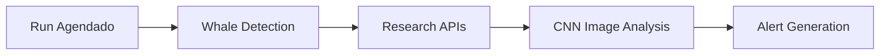

# ExaSignal - Estratégia de Execução

## Decisão de Produto

**Runs agendados (2-3x/dia)** — não 24/7.

Isto não é limitação técnica. É **decisão correta de design**.

---

## Porquê runs agendados?

1. **Mercados AI/tech têm ciclos lentos**
   - Notícias relevantes duram dias, não minutos
   - Whale move às 10h ainda é válido às 18h

2. **Coerência com o produto**
   - "Silêncio faz parte do produto"
   - Máx. 1-2 alertas/dia
   - Não é trading de alta frequência

3. **Custo/benefício**
   - Sem custos de cloud 24/7
   - Sem complexidade de uptime
   - Fácil de monitorar

4. **NewsAPI é snapshot**
   - 2 requests/dia são suficientes
   - Não depende de real-time

---

## Horários Recomendados

| Run | Hora (UTC) | Objetivo |
|-----|------------|----------|
| 1 | 08:00 | Overnight trades |
| 2 | 14:00 | Trades da manhã US |
| 3 | 20:00 | Trades da tarde US |

---

## Implementação

### Cron Job (Linux/Mac)
```bash
# Editar crontab
crontab -e

# Adicionar (ajustar path)
0 8 * * * cd /path/to/POLYMARKET && python -m src.main --once >> logs/run.log 2>&1
0 14 * * * cd /path/to/POLYMARKET && python -m src.main --once >> logs/run.log 2>&1
0 20 * * * cd /path/to/POLYMARKET && python -m src.main --once >> logs/run.log 2>&1
```

### Railway/Fly.io (Cloud)
- Usar "Scheduled Jobs" ou "Cron Jobs"
- Mais barato que container always-on

### GitHub Actions (Grátis)
```yaml
name: ExaSignal Run
on:
  schedule:
    - cron: '0 8,14,20 * * *'
jobs:
  run:
    runs-on: ubuntu-latest
    steps:
      - uses: actions/checkout@v3
      - uses: actions/setup-python@v4
        with:
          python-version: '3.11'
      - run: pip install -r requirements.txt
      - run: python -m src.main --once
        env:
          TELEGRAM_BOT_TOKEN: ${{ secrets.TELEGRAM_BOT_TOKEN }}
          NEWSAPI_KEY: ${{ secrets.NEWSAPI_KEY }}
```

---

## O que acontece em cada run

```
1. Inicializa componentes
2. Para cada mercado:
   - Busca trades grandes (CLOB)
   - Filtra arbitragem/HFT
   - Se whale válido → Research
   - Se score >= 70 → Alerta Telegram
3. Encerra
```

Duração típica: **3-5 minutos**

---

---

## 🚀 Nova Fase: CNN Market Analysis (Opcional Avançado)

### Integração CNN (Futura Expansão)

**✅ MANTÉM FILOSOFIA DE RUNS AGENDADOS:**
- CNN roda nos **mesmos horários** (8h, 14h, 20h UTC)
- **Não adiciona runs extras** - integra nos existentes
- **Mantém timing** - Whale + Research continuam iguais
- **Opcional** - pode ser desabilitada sem quebrar sistema

**Adiciona análise avançada:**



### Cronograma CNN

| Fase | Duração | Objetivo | Status |
|------|---------|----------|---------|
| 0 | 1 semana | Teste validação CNN | Pendente |
| 1 | 2 semanas | Market images básicas | Pendente |
| 2 | 3 semanas | Cross-market analysis | Pendente |
| 3 | 2 semanas | Event integration | Pendente |
| 4 | 4 semanas | Hardware acceleration | Pendente |

### Como Integrar CNN nos Runs

**Mantém timing atual**, mas adiciona análise visual:

```
Run 08:00 (Overnight trades)
├── Whale detection (CLOB)
├── Research APIs (NewsAPI + RSS)
├── 🆕 CNN market analysis (64x64 images)
├── Alert generation
└── Persist results
```

**Benefícios:**
- ✅ Mantém custo baixo (runs agendados)
- ✅ Adiciona análise avançada
- ✅ Não quebra arquitetura existente
- ✅ Pode ser desabilitado via config

### Configuração CNN

```bash
# .env
ENABLE_CNN_ANALYSIS=false  # Começar false, ativar depois
CNN_MODEL_PATH=models/market_cnn_v1.h5
CNN_CONFIDENCE_THRESHOLD=0.65
```

**Documentação completa:** [CNN_MARKET_ANALYSIS.md](CNN_MARKET_ANALYSIS.md)

---

## Regra Final

> Se precisares de correr 24/7 para o ExaSignal funcionar,
> o problema não é a infraestrutura — é o design do produto.

**Adendo CNN:**
> A CNN pode rodar nos mesmos runs agendados,
> adicionando inteligência sem quebrar a filosofia.
