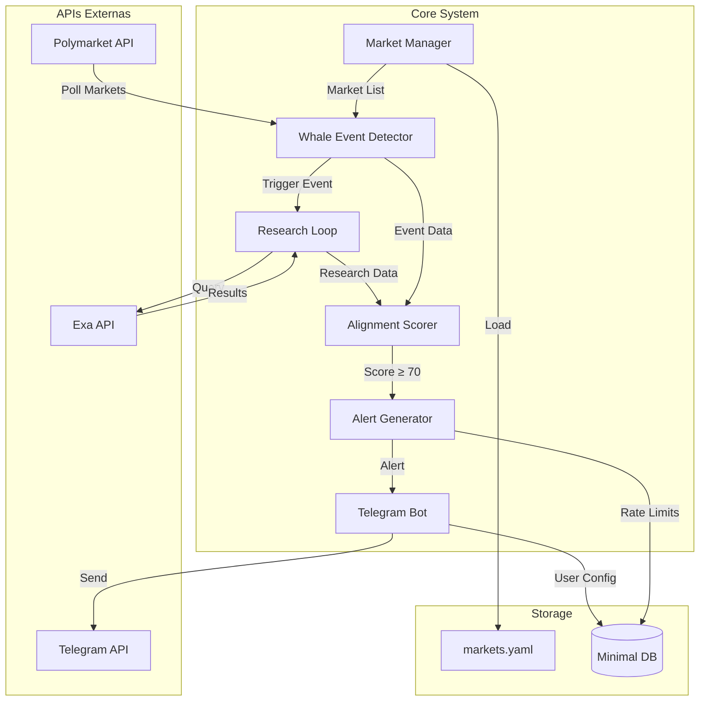
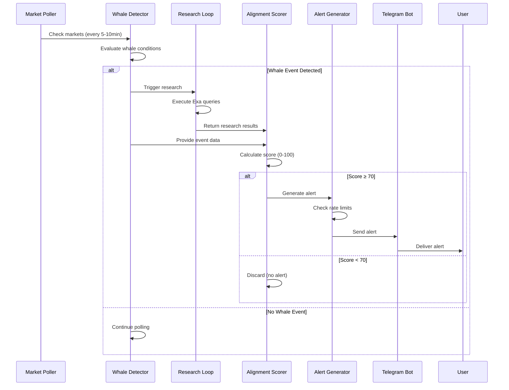

# PRD-00-Overview

## 1. Visão Geral

O **ExaSignal** é um motor de convicção validada por pesquisa para mercados de prediction no Polymarket, focado exclusivamente em AI/frontier tech. Não é um whale tracker tradicional, mas sim um sistema que combina detecção comportamental de eventos de whale com validação via pesquisa semântica (Exa API) para gerar alertas de alta confiança.

**Objetivo do MVP:** Poucos alertas, alta confiança, decisão em <20 segundos.

**Canal único:** Telegram bot

**Contexto no produto:** Este documento serve como visão geral e arquitetura de alto nível. Os demais PRDs detalham componentes específicos.

**Dependências entre componentes:**
- Market Management → Whale Detection → Research Loop → Alignment Score → Alert Generation → Telegram Bot
- Todos os componentes dependem da configuração inicial (markets.yaml)

## 2. Objetivos e Métricas

### Objetivos de Negócio
- Validar a hipótese de que pesquisa semântica pode melhorar a qualidade de sinais de whale
- Criar um produto que compete com julgamento humano, não com ferramentas
- Estabelecer "silêncio como sinal de qualidade"

### Métricas de Sucesso (MVP)
- Alertas ≤ 1-2/dia
- Cada alerta é "interrupt-worthy"
- Usuário decide em <20 segundos
- Criador apostaria com base no alerta

### KPIs Específicos
- Taxa de alertas por evento de whale detectado: <10%
- Score médio de alertas enviados: ≥75
- Taxa de falsos positivos: <20% (validado manualmente)
- Tempo médio de processamento: <30 segundos por evento

## 3. Requisitos Funcionais

### RF-001: Sistema de Mercados Pré-definidos
O sistema deve operar apenas com 10-15 mercados pré-definidos na categoria AI/frontier tech, carregados de `markets.yaml`.

### RF-002: Detecção de Eventos de Whale
O sistema deve detectar eventos comportamentais de whale baseados em regras específicas (nova posição, size threshold, wallet inativa, exposição direcional).

### RF-003: Loop de Pesquisa Condicional
O sistema deve executar pesquisa via Exa API apenas após detecção de evento de whale válido.

### RF-004: Cálculo de Alignment Score
O sistema deve calcular um score determinístico (0-100) baseado em credibilidade, recência, consenso, especificidade e divergência.

### RF-005: Geração de Alertas Condicionais
O sistema deve gerar alertas apenas quando score ≥ 70, respeitando limites de rate (máx 2/dia, cooldown 24h por mercado).

### RF-006: Bot Telegram Funcional
O sistema deve fornecer interface Telegram com comandos básicos (/start, /markets, /status, /settings).

## 4. Requisitos Não-Funcionais

### Performance
- Processamento de evento completo: <30 segundos
- Polling de mercados: intervalo configurável (sugestão: 5-10 minutos)
- Resposta do bot Telegram: <2 segundos

### Confiabilidade
- Disponibilidade: 95% (MVP)
- Tratamento de erros de API externas (Exa, Polymarket)
- Retry logic para falhas temporárias

### Segurança
- Credenciais em variáveis de ambiente
- Validação de inputs de usuário
- Rate limiting no bot para prevenir abuse

### Escalabilidade
- Suportar até 100 usuários simultâneos (MVP)
- Arquitetura preparada para horizontal scaling (async workers)

## 5. User Stories

### US-001: Como usuário, eu quero receber alertas apenas quando há alta confiança
**Critérios de aceitação:**
- Alertas só são enviados com score ≥ 70
- Máximo 2 alertas por dia
- Cada alerta contém justificativa clara

### US-002: Como usuário, eu quero ver quais mercados estão sendo monitorados
**Critérios de aceitação:**
- Comando `/markets` lista todos os mercados ativos
- Lista mostra nome e odds atuais

### US-003: Como usuário, eu quero ajustar meu threshold de score mínimo
**Critérios de aceitação:**
- Comando `/settings` permite alterar threshold
- Threshold padrão: 70
- Alterações são persistidas por usuário

## 6. Fluxos e Processos

### Arquitetura de Sistema

### Fluxo End-to-End de um Alerta

## 7. Especificações Técnicas

### Stack Técnico

**Backend:**
- Linguagem: Python 3.11+
- Framework: FastAPI ou async worker (asyncio)
- Bibliotecas principais:
  - `python-telegram-bot` (Telegram)
  - `exa_py` (Exa API)
  - `httpx` ou `aiohttp` (HTTP async)
  - `pyyaml` (configuração)

**APIs Externas:**
- Polymarket Data API / Gamma API (polling de mercados)
- Exa API (pesquisa semântica)
- Telegram Bot API

**Configuração:**
- `markets.yaml` (mercados pré-definidos)
- Variáveis de ambiente (credenciais, thresholds)

**Deploy:**
- Plataforma simples: Vercel / Fly.io / Railway
- Sem over-engineering

### Integração entre Componentes

**Market Manager → Whale Detector:**
- Fornece lista de mercados ativos
- Valida market_id antes de processar

**Whale Detector → Research Loop:**
- Dispara pesquisa apenas para eventos válidos
- Passa contexto do mercado (nome, subject, direção)

**Research Loop → Alignment Scorer:**
- Retorna resultados estruturados da Exa
- Inclui metadados (fonte, data, relevância)

**Alignment Scorer → Alert Generator:**
- Score ≥ 70: gera alerta
- Score < 70: descarta silenciosamente
- Inclui top 2 razões do score

**Alert Generator → Telegram Bot:**
- Formata mensagem conforme schema
- Verifica rate limits antes de enviar
- Persiste alerta enviado (mínimo necessário)

## 8. Critérios de Aceitação

### Testes Funcionais
- [ ] Sistema carrega markets.yaml corretamente
- [ ] Whale detector identifica eventos conforme regras
- [ ] Research loop executa queries Exa corretamente
- [ ] Alignment score calcula corretamente (0-100)
- [ ] Alertas são gerados apenas com score ≥ 70
- [ ] Rate limits são respeitados (máx 2/dia, cooldown 24h)
- [ ] Bot Telegram responde a todos os comandos

### Testes de Integração
- [ ] Fluxo completo: evento → pesquisa → score → alerta
- [ ] Tratamento de erros de APIs externas
- [ ] Persistência de configurações de usuário
- [ ] Cooldown funciona corretamente por mercado

### Validações Específicas
- [ ] Alertas seguem schema exato definido
- [ ] Score é explicável (top 2 razões identificadas)
- [ ] Sistema não envia alertas duplicados
- [ ] Performance: <30s por evento completo

## 9. Riscos e Dependências

### Riscos Técnicos

**Risco 1: Rate Limits de APIs Externas**
- **Impacto:** Alto - pode bloquear pesquisa ou polling
- **Mitigação:** Implementar retry com backoff exponencial, cache de resultados quando apropriado

**Risco 2: Mudanças nas APIs do Polymarket**
- **Impacto:** Alto - pode quebrar detecção de eventos
- **Mitigação:** Abstrair acesso via camada de adaptador, monitorar mudanças

**Risco 3: Qualidade dos resultados da Exa**
- **Impacto:** Médio - pode afetar qualidade do score
- **Mitigação:** Validar resultados manualmente no MVP, ajustar queries conforme necessário

**Risco 4: Falsos Positivos**
- **Impacto:** Médio - pode degradar confiança do usuário
- **Mitigação:** Threshold alto (≥70), validação manual inicial

### Dependências Externas

1. **Polymarket Data API / Gamma API**
   - Acesso necessário para polling de mercados
   - Dependência crítica

2. **Exa API**
   - Acesso necessário para pesquisa semântica
   - Dependência crítica
   - Requer chave de API válida

3. **Telegram Bot API**
   - Acesso necessário para entrega de alertas
   - Dependência crítica
   - Requer bot token

### Mitigações

- Implementar health checks para todas as APIs externas
- Logging detalhado para debugging
- Fallback graceful quando APIs estão indisponíveis
- Monitoramento básico de uptime

## 10. Notas de Implementação

### Considerações Técnicas

- **Async/Await:** Usar async em todo o fluxo para não bloquear durante chamadas de API
- **Error Handling:** Implementar tratamento robusto de erros, especialmente para APIs externas
- **Logging:** Log estruturado para facilitar debugging e monitoramento
- **Configuração:** Centralizar configurações em arquivo YAML + env vars

### Decisões de Design

- **Sem ML no MVP:** Score é determinístico e explicável
- **Sem persistência pesada:** Apenas mínimo necessário (rate limits, configs de usuário)
- **Polling vs Webhooks:** Polling é mais simples para MVP, webhooks podem vir depois
- **Single Channel:** Apenas Telegram no MVP, outros canais podem vir depois

### Limitações Conhecidas

- **Mercados fixos:** Não há auto-descoberta de mercados no MVP
- **Score fixo:** Algoritmo de scoring não aprende/adapta no MVP
- **Sem histórico:** Não há armazenamento de longo prazo de pesquisas ou eventos
- **Manual validation:** Alguns aspectos requerem validação manual inicial

### Próximos Passos (Pós-MVP)

- Dashboard web (se necessário)
- Backtesting UI
- Auto-descoberta de mercados
- ML para melhorar scoring
- Múltiplos canais (Email, Discord)

---

**Referências:**
- [README.md](../../README.md) - Documento principal do projeto
- [PRD-01-Market-Management.md](PRD-01-Market-Management.md)
- [PRD-02-Whale-Event-Detection.md](PRD-02-Whale-Event-Detection.md)
- [PRD-03-Research-Loop.md](PRD-03-Research-Loop.md)
- [PRD-04-Alignment-Score.md](PRD-04-Alignment-Score.md)
- [PRD-05-Alert-Generation.md](PRD-05-Alert-Generation.md)
- [PRD-06-Telegram-Bot.md](PRD-06-Telegram-Bot.md)

