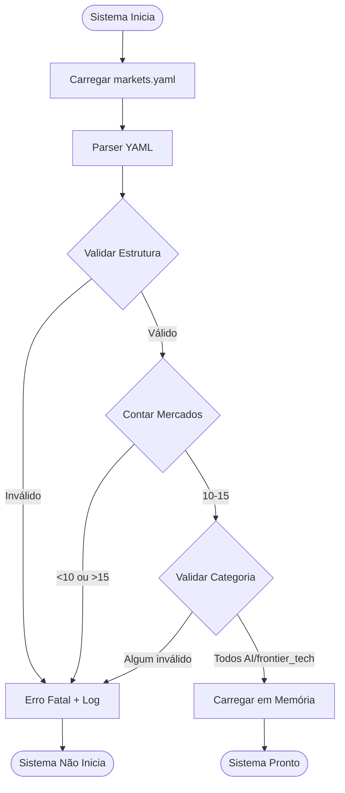
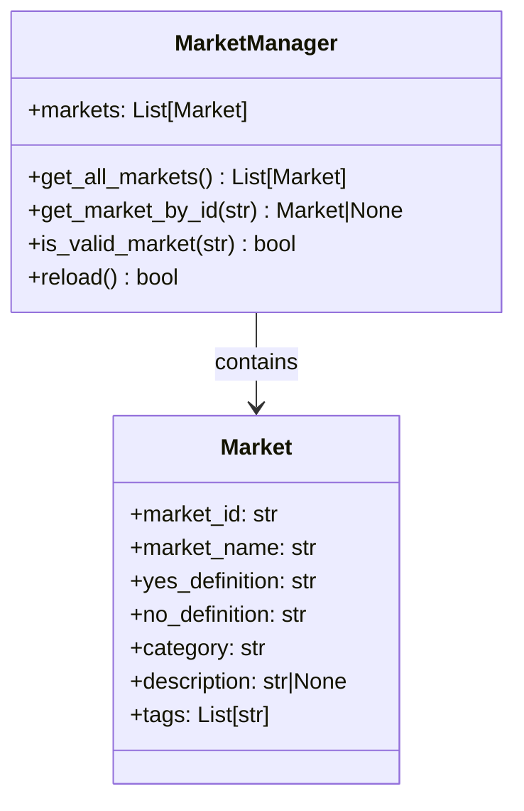

# PRD-01-Market-Management

## 1. Visão Geral

O sistema de gestão de mercados é responsável por carregar, validar e fornecer acesso aos mercados pré-definidos que o ExaSignal monitora. No MVP, apenas 10-15 mercados da categoria AI/frontier tech são suportados, carregados de um arquivo `markets.yaml`.

**Objetivo:** Garantir que apenas mercados válidos e pré-aprovados sejam monitorados, mantendo o foco em alta qualidade sobre alta cobertura.

**Contexto no produto:** Este componente é fundamental - todos os outros componentes dependem dele para saber quais mercados monitorar.

**Dependências:**
- Nenhuma dependência externa (carrega de arquivo local)
- Outros componentes dependem deste para obter lista de mercados

## 2. Objetivos e Métricas

### Objetivos de Negócio
- Manter escopo focado em AI/frontier tech
- Garantir qualidade dos mercados monitorados
- Facilitar manutenção e atualização de mercados

### Métricas de Sucesso
- 100% dos mercados carregados são válidos
- Tempo de carregamento <1 segundo
- Zero mercados fora do escopo (AI/frontier tech)

### KPIs Específicos
- Número de mercados: 10-15 (hard limit)
- Taxa de validação: 100%
- Tempo de carregamento: <500ms

## 3. Requisitos Funcionais

### RF-001: Carregamento de markets.yaml
O sistema deve carregar mercados de um arquivo `markets.yaml` na inicialização.

**Critérios:**
- Arquivo deve existir e ser válido YAML
- Erro fatal se arquivo não existir ou for inválido
- Suporta hot-reload (recarregar sem reiniciar) - opcional no MVP

### RF-002: Validação de Estrutura
O sistema deve validar que cada mercado possui campos obrigatórios.

**Campos obrigatórios:**
- `market_id`: string único identificando o mercado no Polymarket
- `market_name`: string com nome legível do mercado
- `yes_definition`: string descrevendo o que significa YES
- `no_definition`: string descrevendo o que significa NO
- `category`: deve ser "AI" ou "frontier_tech"

### RF-003: Validação de Escopo
O sistema deve garantir que apenas mercados de AI/frontier tech são aceitos.

**Regras:**
- `category` deve ser "AI" ou "frontier_tech"
- Rejeitar mercados com categoria diferente
- Log de warning para mercados rejeitados

### RF-004: Limite de Mercados
O sistema deve impor limite de 10-15 mercados.

**Regras:**
- Aceitar entre 10 e 15 mercados (inclusive)
- Erro fatal se <10 ou >15 mercados
- Mensagem de erro clara indicando o problema

### RF-005: Acesso à Lista de Mercados
O sistema deve fornecer interface para outros componentes acessarem a lista de mercados.

**Métodos necessários:**
- `get_all_markets()`: retorna lista completa
- `get_market_by_id(market_id)`: retorna mercado específico
- `is_valid_market(market_id)`: verifica se mercado existe

### RF-006: Metadados Adicionais (Opcional)
O sistema pode armazenar metadados adicionais por mercado.

**Campos opcionais:**
- `description`: descrição detalhada do mercado
- `tags`: lista de tags para categorização
- `created_at`: data de criação do mercado
- `notes`: notas internas sobre o mercado

## 4. Requisitos Não-Funcionais

### Performance
- Carregamento inicial: <500ms para 15 mercados
- Lookup por ID: <10ms
- Uso de memória: mínimo (apenas dados essenciais)

### Confiabilidade
- Validação rigorosa na inicialização
- Erro fatal se dados inválidos (fail-fast)
- Logging claro de problemas de validação

### Segurança
- Validação de inputs (prevenir injection via YAML)
- Sanitização de strings (remover caracteres perigosos)
- Validação de tipos (não confiar em YAML implicitamente)

### Escalabilidade
- Suporta até 15 mercados (hard limit MVP)
- Estrutura preparada para expansão futura (sem refactor)

## 5. User Stories

### US-001: Como desenvolvedor, eu quero adicionar novos mercados editando markets.yaml
**Critérios de aceitação:**
- Editar arquivo YAML e sistema recarrega (ou requer restart)
- Validação clara de erros de formato
- Mensagens de erro indicam linha e problema específico

### US-002: Como sistema, eu quero validar mercados na inicialização
**Critérios de aceitação:**
- Sistema não inicia se markets.yaml inválido
- Todos os campos obrigatórios são validados
- Categoria é validada (apenas AI/frontier_tech)

### US-003: Como componente Whale Detector, eu quero acessar lista de mercados válidos
**Critérios de aceitação:**
- Método `get_all_markets()` retorna lista completa
- Método `get_market_by_id()` retorna mercado ou None
- Performance adequada para polling frequente

## 6. Fluxos e Processos

### Fluxo de Carregamento



### Estrutura de Dados



## 7. Especificações Técnicas

### Estrutura do markets.yaml

```yaml
markets:
  - market_id: "0x1234..."
    market_name: "Best AI Model by End of 2025"
    yes_definition: "Modelo líder em benchmarks e adoção"
    no_definition: "Qualquer outro resultado"
    category: "AI"
    description: "Mercado para determinar qual modelo de IA será considerado o melhor até o final de 2025"
    tags:
      - "AI"
      - "models"
      - "2025"
  
  - market_id: "0x5678..."
    market_name: "OpenAI vs Google vs Anthropic Outcomes"
    yes_definition: "OpenAI mantém liderança"
    no_definition: "Google ou Anthropic assumem liderança"
    category: "AI"
    tags:
      - "AI"
      - "companies"
      - "competition"
  
  - market_id: "0x9abc..."
    market_name: "First AGI Claim"
    yes_definition: "Primeira reivindicação credível de AGI até 2026"
    no_definition: "Nenhuma reivindicação credível até 2026"
    category: "frontier_tech"
    tags:
      - "AGI"
      - "frontier"
      - "2026"
```

### Schema de Validação

```python
# Estrutura esperada (pseudo-código)
MarketSchema:
  market_id: str (required, non-empty, unique)
  market_name: str (required, non-empty, max 200 chars)
  yes_definition: str (required, non-empty, max 500 chars)
  no_definition: str (required, non-empty, max 500 chars)
  category: str (required, enum: ["AI", "frontier_tech"])
  description: str (optional, max 1000 chars)
  tags: List[str] (optional, max 10 tags, each max 50 chars)
```

### Interface da Classe MarketManager

```python
class MarketManager:
    def __init__(self, config_path: str = "markets.yaml"):
        """Inicializa e carrega mercados do arquivo YAML."""
        
    def get_all_markets(self) -> List[Market]:
        """Retorna lista completa de mercados válidos."""
        
    def get_market_by_id(self, market_id: str) -> Optional[Market]:
        """Retorna mercado específico por ID, ou None se não existir."""
        
    def is_valid_market(self, market_id: str) -> bool:
        """Verifica se market_id existe na lista de mercados."""
        
    def reload(self) -> bool:
        """Recarrega markets.yaml do disco. Retorna True se sucesso."""
        
    def validate_markets(self) -> Tuple[bool, List[str]]:
        """Valida todos os mercados. Retorna (is_valid, errors)."""
```

### Classe Market

```python
@dataclass
class Market:
    market_id: str
    market_name: str
    yes_definition: str
    no_definition: str
    category: str
    description: Optional[str] = None
    tags: List[str] = field(default_factory=list)
    
    def validate(self) -> Tuple[bool, List[str]]:
        """Valida campos do mercado. Retorna (is_valid, errors)."""
        
    def to_dict(self) -> Dict[str, Any]:
        """Converte mercado para dicionário."""
```

## 8. Critérios de Aceitação

### Testes Funcionais

- [ ] Sistema carrega markets.yaml corretamente na inicialização
- [ ] Erro fatal se arquivo não existir
- [ ] Erro fatal se YAML inválido
- [ ] Erro fatal se <10 mercados
- [ ] Erro fatal se >15 mercados
- [ ] Erro fatal se mercado com categoria inválida
- [ ] Erro fatal se mercado sem campos obrigatórios
- [ ] `get_all_markets()` retorna lista completa
- [ ] `get_market_by_id()` retorna mercado correto
- [ ] `get_market_by_id()` retorna None para ID inválido
- [ ] `is_valid_market()` retorna True para IDs válidos
- [ ] `is_valid_market()` retorna False para IDs inválidos

### Testes de Integração

- [ ] Whale Detector consegue acessar lista de mercados
- [ ] Sistema não inicia se markets.yaml inválido
- [ ] Logs claros indicam problemas de validação

### Validações Específicas

- [ ] Todos os market_id são únicos
- [ ] Categorias são apenas "AI" ou "frontier_tech"
- [ ] Strings não contêm caracteres perigosos
- [ ] Performance: carregamento <500ms para 15 mercados

## 9. Riscos e Dependências

### Riscos Técnicos

**Risco 1: YAML Malformado**
- **Impacto:** Alto - sistema não inicia
- **Mitigação:** Validação rigorosa, mensagens de erro claras, exemplo de formato na documentação

**Risco 2: Mercados Duplicados**
- **Impacto:** Médio - pode causar processamento duplicado
- **Mitigação:** Validação de market_id único na inicialização

**Risco 3: Mercados Fora do Escopo**
- **Impacto:** Médio - viola filosofia do produto
- **Mitigação:** Validação de categoria obrigatória, rejeição automática

**Risco 4: market_id Inválido no Polymarket**
- **Impacto:** Alto - sistema tenta monitorar mercado inexistente
- **Mitigação:** Validação manual inicial, possível validação via API no futuro

### Dependências Externas

- **PyYAML:** Biblioteca para parsing de YAML
- **Nenhuma dependência de API externa** (mercados são pré-definidos)

### Mitigações

- Incluir arquivo de exemplo (`markets.yaml.example`)
- Documentação clara do formato esperado
- Validação fail-fast na inicialização
- Logging detalhado de problemas

## 10. Notas de Implementação

### Considerações Técnicas

- **Singleton Pattern:** MarketManager deve ser singleton (uma única instância)
- **Lazy Loading:** Carregar apenas na inicialização, não a cada acesso
- **Caching:** Manter lista em memória após carregamento
- **Thread Safety:** Se usar threads, garantir acesso thread-safe (lock se necessário)

### Decisões de Design

- **YAML vs JSON:** YAML escolhido por ser mais legível para humanos
- **Hard Limit:** 10-15 mercados é hard limit no MVP, não configurável
- **Fail-Fast:** Erros de validação impedem inicialização (não continua com dados inválidos)
- **Sem Auto-Discovery:** Mercados devem ser adicionados manualmente (filosofia do produto)

### Limitações Conhecidas

- **Mercados Fixos:** Não há descoberta automática de mercados
- **Sem Validação de Polymarket:** market_id não é validado contra API do Polymarket (validação manual)
- **Hot Reload Opcional:** Recarregar sem restart pode não estar no MVP inicial
- **Sem Versionamento:** Não há histórico de mudanças em markets.yaml

### Exemplo de Implementação Python

```python
import yaml
from typing import List, Optional, Tuple, Dict, Any
from dataclasses import dataclass, field
from pathlib import Path

@dataclass
class Market:
    market_id: str
    market_name: str
    yes_definition: str
    no_definition: str
    category: str
    description: Optional[str] = None
    tags: List[str] = field(default_factory=list)
    
    def validate(self) -> Tuple[bool, List[str]]:
        errors = []
        if not self.market_id:
            errors.append("market_id is required")
        if not self.market_name:
            errors.append("market_name is required")
        if self.category not in ["AI", "frontier_tech"]:
            errors.append(f"category must be 'AI' or 'frontier_tech', got '{self.category}'")
        return (len(errors) == 0, errors)

class MarketManager:
    def __init__(self, config_path: str = "markets.yaml"):
        self.config_path = Path(config_path)
        self.markets: List[Market] = []
        self._load_markets()
    
    def _load_markets(self):
        if not self.config_path.exists():
            raise FileNotFoundError(f"markets.yaml not found at {self.config_path}")
        
        with open(self.config_path, 'r') as f:
            data = yaml.safe_load(f)
        
        if 'markets' not in data:
            raise ValueError("markets.yaml must contain 'markets' key")
        
        markets_data = data['markets']
        
        if not isinstance(markets_data, list):
            raise ValueError("markets must be a list")
        
        if len(markets_data) < 10 or len(markets_data) > 15:
            raise ValueError(f"Must have 10-15 markets, got {len(markets_data)}")
        
        market_ids = set()
        for m_data in markets_data:
            market = Market(**m_data)
            is_valid, errors = market.validate()
            if not is_valid:
                raise ValueError(f"Invalid market: {', '.join(errors)}")
            if market.market_id in market_ids:
                raise ValueError(f"Duplicate market_id: {market.market_id}")
            market_ids.add(market.market_id)
            self.markets.append(market)
    
    def get_all_markets(self) -> List[Market]:
        return self.markets.copy()
    
    def get_market_by_id(self, market_id: str) -> Optional[Market]:
        for market in self.markets:
            if market.market_id == market_id:
                return market
        return None
    
    def is_valid_market(self, market_id: str) -> bool:
        return self.get_market_by_id(market_id) is not None
```

---

**Referências:**
- [PRD-00-Overview.md](PRD-00-Overview.md) - Visão geral do sistema
- [README.md](../../README.md) - Documento principal do projeto

