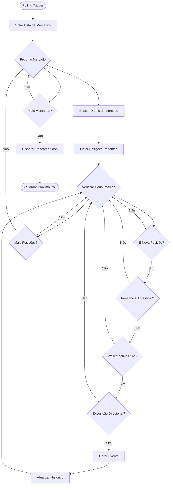
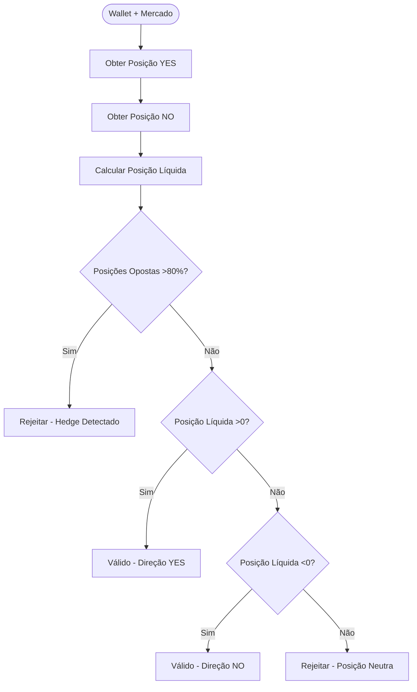

# PRD-02-Whale-Event-Detection

## 1. Visão Geral

O sistema de detecção de eventos de whale identifica comportamentos específicos que indicam convicção real de grandes apostadores, baseado em padrões comportamentais ao invés de listas pré-definidas de wallets. Um evento de whale é detectado quando TODAS as condições comportamentais são verdadeiras simultaneamente.

**Objetivo:** Identificar eventos de whale com alta convicção, evitando falsos positivos de top-ups ou hedging.

**Contexto no produto:** Este componente é o trigger inicial do pipeline. Sem detecção de evento válido, nenhuma pesquisa ou alerta é gerado.

**Dependências:**
- Market Manager (para obter lista de mercados a monitorar)
- Gamma API (para dados de mercados e odds atuais)
- **CLOB API (obrigatória)** - Para trades individuais e detecção comportamental
- Histórico mínimo de wallets (para verificar inatividade)

**⚠️ IMPORTANTE:** A detecção de whales comportamentais requer dados de trades individuais, não apenas volume agregado. A CLOB API é obrigatória para implementar as regras de detecção (nova posição grande, wallet inativa, exposição direcional).

## 2. Objetivos e Métricas

### Objetivos de Negócio
- Detectar apenas eventos com convicção real (não top-ups ou hedging)
- Minimizar falsos positivos
- Identificar padrões comportamentais significativos

### Métricas de Sucesso
- Taxa de eventos detectados que resultam em alertas: 5-10% (alta seletividade)
- Falsos positivos (eventos que não deveriam ser detectados): <20%
- Cobertura: monitorar todos os mercados pré-definidos

### KPIs Específicos
- Frequência de polling: 5-10 minutos
- Tempo de processamento por mercado: <5 segundos
- Taxa de eventos detectados: ~1-3 por dia (estimativa)

## 3. Requisitos Funcionais

### RF-001: Polling de Mercados e Trades
O sistema deve fazer polling periódico de todos os mercados pré-definidos e monitorar trades em tempo real.

**Critérios:**
- Intervalo configurável para polling (padrão: 5-10 minutos)
- **WebSocket para trades em tempo real (recomendado)** - reduz latency e melhora performance
- Polling assíncrono para não bloquear sistema
- Tratamento de erros de API (retry com backoff)
- Usar CLOB API para obter trades individuais com size, price, side, maker/taker

### RF-002: Detecção de Nova Posição
O sistema deve identificar quando uma wallet abre uma nova posição (não top-up).

**Critérios:**
- Comparar posição atual com histórico
- Nova posição = wallet não tinha posição anterior OU aumentou significativamente (>50%)
- Ignorar top-ups pequenos (<50% do tamanho atual)

### RF-003: Validação de Size Threshold
O sistema deve validar que o tamanho da posição atinge threshold mínimo.

**Critérios:**
- Size ≥ max($10,000 USD, 2% da liquidez do mercado)
- Calcular liquidez atual do mercado dinamicamente
- Converter valores para USD se necessário

### RF-004: Validação de Wallet Inativa
O sistema deve verificar que a wallet estava inativa nesse mercado específico.

**Critérios:**
- Wallet não tinha posição ativa neste mercado há ≥14 dias
- Verificar histórico de transações da wallet neste mercado
- Considerar apenas este mercado específico (não global)

### RF-005: Validação de Exposição Direcional
O sistema deve garantir que a posição é direcional (sem hedge).

**Critérios:**
- Posição líquida deve ser claramente YES ou NO
- Se wallet tem posições em ambos os lados, calcular exposição líquida
- Hedge = posições opostas >80% do tamanho da maior posição
- Rejeitar se hedge detectado

### RF-006: Geração de Evento
O sistema deve gerar objeto de evento estruturado quando todas as condições são verdadeiras.

**Estrutura do evento:**
```json
{
  "market_id": "0x1234...",
  "direction": "YES" | "NO",
  "size_usd": 25000,
  "wallet_address": "0xabcd...",
  "wallet_age_days": 180,
  "liquidity_ratio": 0.031,
  "timestamp": "2025-01-15T10:30:00Z",
  "is_new_position": true,
  "previous_position_size": 0
}
```

### RF-007: Tracking de Histórico
O sistema deve manter histórico mínimo de wallets e posições.

**Critérios:**
- Armazenar última posição conhecida por wallet+mercado
- Armazenar timestamp da última transação
- Limpar histórico antigo (>90 dias) para economizar espaço

## 4. Requisitos Não-Funcionais

### Performance
- Processamento de todos os mercados: <30 segundos
- Polling não deve bloquear sistema principal
- Lookup de histórico: <100ms por wallet

### Confiabilidade
- Tratamento robusto de erros de API
- Retry logic para falhas temporárias
- Logging detalhado de eventos detectados

### Segurança
- Validação de dados recebidos da API
- Sanitização de wallet addresses
- Rate limiting para evitar abuse de API

### Escalabilidade
- Suporta até 15 mercados simultaneamente
- Histórico otimizado (apenas dados necessários)
- Preparado para aumentar frequência de polling se necessário

## 5. User Stories

### US-001: Como sistema, eu quero detectar apenas eventos com convicção real
**Critérios de aceitação:**
- Rejeitar top-ups de posições existentes
- Rejeitar wallets que fazem hedging
- Rejeitar wallets muito ativas (sem período de inatividade)

### US-002: Como sistema, eu quero calcular thresholds dinamicamente
**Critérios de aceitação:**
- Threshold baseado em liquidez atual do mercado
- Mínimo absoluto de $10k USD
- Cálculo correto de porcentagem de liquidez

### US-003: Como Research Loop, eu quero receber eventos estruturados
**Critérios de aceitação:**
- Evento contém todos os campos necessários
- Formato JSON válido e consistente
- Timestamp preciso e timezone UTC

## 6. Fluxos e Processos

### Fluxo de Detecção



### Cálculo de Threshold Dinâmico

```mermaid
flowchart TD
    Start([Receber Posição]) --> GetLiquidity[Obter Liquidez do Mercado]
    GetLiquidity --> CalcPercent[Calcular 2% da Liquidez]
    CalcPercent --> GetMin[Obter Mínimo $10k USD]
    GetMin --> Compare{Comparar Valores}
    Compare --> Max[Threshold = max(2% Liquidez, $10k)]
    Max --> Validate{Posição ≥ Threshold?}
    Validate -->|Sim| Valid[Posição Válida]
    Validate -->|Não| Invalid[Posição Inválida]
```

### Validação de Exposição Direcional



## 7. Especificações Técnicas

### Estrutura de Dados do Evento

```python
@dataclass
class WhaleEvent:
    market_id: str
    direction: str  # "YES" | "NO"
    size_usd: float
    wallet_address: str
    wallet_age_days: int
    liquidity_ratio: float  # size_usd / total_liquidity
    timestamp: datetime
    is_new_position: bool
    previous_position_size: float
    
    def to_dict(self) -> Dict[str, Any]:
        """Converte evento para dicionário JSON-serializável."""
        return {
            "market_id": self.market_id,
            "direction": self.direction,
            "size_usd": self.size_usd,
            "wallet_address": self.wallet_address,
            "wallet_age_days": self.wallet_age_days,
            "liquidity_ratio": self.liquidity_ratio,
            "timestamp": self.timestamp.isoformat(),
            "is_new_position": self.is_new_position,
            "previous_position_size": self.previous_position_size
        }
```

### Histórico de Wallet

```python
@dataclass
class WalletHistory:
    wallet_address: str
    market_id: str
    last_position_size: float
    last_position_direction: str  # "YES" | "NO" | "NONE"
    last_transaction_timestamp: datetime
    total_transactions: int
    
    def is_inactive(self, days_threshold: int = 14) -> bool:
        """Verifica se wallet está inativa há pelo menos X dias."""
        delta = datetime.now() - self.last_transaction_timestamp
        return delta.days >= days_threshold
    
    def has_active_position(self) -> bool:
        """Verifica se wallet tem posição ativa."""
        return self.last_position_direction != "NONE" and self.last_position_size > 0
```

### Cliente CLOB API

```python
from py_clob_client.client import ClobClient

class CLOBAPIClient:
    def __init__(self):
        """Inicializa cliente CLOB (read-only, sem auth necessária)."""
        self.client = ClobClient()
    
    async def get_recent_trades(
        self,
        market_id: str,
        limit: int = 100
    ) -> List[Dict]:
        """Obtém trades recentes de um mercado."""
        trades = self.client.get_trades(market_id=market_id, limit=limit)
        return trades
    
    async def listen_trades_websocket(
        self,
        market_id: str,
        callback: Callable
    ):
        """Escuta trades em tempo real via WebSocket."""
        async for trade in self.client.ws_trades(market_id):
            await callback(trade)
    
    def get_trade_size_usd(self, trade: Dict) -> float:
        """Calcula size em USD de um trade."""
        # Implementar conversão baseada em price e size do trade
        return trade['size'] * trade['price']
```

### Interface da Classe WhaleDetector

```python
class WhaleDetector:
    def __init__(
        self,
        market_manager: MarketManager,
        gamma_api: GammaAPIClient,  # Para dados de mercado e odds
        clob_api: CLOBAPIClient,     # Para trades individuais (obrigatório)
        polling_interval: int = 300,  # 5 minutos
        use_websocket: bool = True    # Usar WebSocket para trades em tempo real
    ):
        """Inicializa detector com dependências."""
        
    async def start_polling(self):
        """Inicia loop de polling assíncrono e WebSocket para trades."""
        if self.use_websocket:
            # Iniciar WebSocket para cada mercado
            for market in self.market_manager.get_all_markets():
                asyncio.create_task(
                    self._listen_trades(market.market_id)
                )
        else:
            # Fallback para polling periódico
            await self._start_polling_loop()
        
    async def _listen_trades(self, market_id: str):
        """Escuta trades em tempo real via WebSocket."""
        async for trade in self.clob_api.listen_trades_websocket(
            market_id,
            self._process_trade
        ):
            pass
    
    async def _process_trade(self, trade: Dict):
        """Processa trade recebido via WebSocket."""
        # Verificar condições de whale event
        await self._check_trade_for_whale_event(trade)
        
    async def check_market(self, market_id: str) -> List[WhaleEvent]:
        """Verifica um mercado específico e retorna eventos detectados."""
        
    def _is_new_position(
        self,
        wallet_address: str,
        market_id: str,
        current_size: float
    ) -> bool:
        """Verifica se posição é nova (não top-up)."""
        
    def _meets_size_threshold(
        self,
        size_usd: float,
        market_liquidity: float
    ) -> bool:
        """Verifica se tamanho atinge threshold."""
        
    def _is_wallet_inactive(
        self,
        wallet_address: str,
        market_id: str,
        days_threshold: int = 14
    ) -> bool:
        """Verifica se wallet está inativa."""
        
    def _is_directional(
        self,
        wallet_address: str,
        market_id: str
    ) -> Tuple[bool, str]:
        """Verifica se exposição é direcional. Retorna (is_directional, direction)."""
        
    def _get_wallet_history(
        self,
        wallet_address: str,
        market_id: str
    ) -> Optional[WalletHistory]:
        """Obtém histórico de wallet para mercado específico."""
        
    def _update_history(
        self,
        wallet_address: str,
        market_id: str,
        position_size: float,
        direction: str
    ):
        """Atualiza histórico de wallet."""
```

### Algoritmo de Detecção (Pseudocódigo)

```python
async def detect_whale_events(market_id: str) -> List[WhaleEvent]:
    events = []
    
    # 1. Obter dados do mercado via Gamma API
    market_data = await gamma_api.get_market_data(market_id)
    liquidity = market_data.total_liquidity_usd
    
    # 2. Calcular threshold
    threshold_usd = max(10000, liquidity * 0.02)
    
    # 3. Obter trades recentes via CLOB API
    recent_trades = await clob_api.get_recent_trades(
        market_id,
        limit=100  # últimos 100 trades
    )
    
    # Agrupar trades por wallet para calcular posições
    wallet_positions = {}
    for trade in recent_trades:
        wallet = trade['maker'] or trade['taker']  # Identificar wallet
        if wallet not in wallet_positions:
            wallet_positions[wallet] = {'YES': 0, 'NO': 0}
        
        side = trade['side']  # 'YES' ou 'NO'
        size_usd = clob_api.get_trade_size_usd(trade)
        wallet_positions[wallet][side] += size_usd
    
    # 4. Verificar cada posição
    for position in recent_positions:
        wallet = position.wallet_address
        size_usd = position.size_usd
        direction = position.direction
        
        # Condição 1: Nova posição?
        if not _is_new_position(wallet, market_id, size_usd):
            continue
        
        # Condição 2: Size threshold?
        if size_usd < threshold_usd:
            continue
        
        # Condição 3: Wallet inativa?
        if not _is_wallet_inactive(wallet, market_id, days_threshold=14):
            continue
        
        # Condição 4: Exposição direcional?
        is_directional, net_direction = _is_directional(wallet, market_id)
        if not is_directional or net_direction != direction:
            continue
        
        # Todas as condições verdadeiras - gerar evento
        history = _get_wallet_history(wallet, market_id)
        event = WhaleEvent(
            market_id=market_id,
            direction=direction,
            size_usd=size_usd,
            wallet_address=wallet,
            wallet_age_days=history.wallet_age_days if history else 0,
            liquidity_ratio=size_usd / liquidity,
            timestamp=datetime.now(),
            is_new_position=True,
            previous_position_size=0
        )
        events.append(event)
        
        # Atualizar histórico
        _update_history(wallet, market_id, size_usd, direction)
    
    return events
```

## 8. Critérios de Aceitação

### Testes Funcionais

- [ ] Sistema faz polling de todos os mercados pré-definidos
- [ ] Detecta nova posição corretamente (não top-up)
- [ ] Rejeita top-ups de posições existentes
- [ ] Calcula threshold dinamicamente (max($10k, 2% liquidez))
- [ ] Valida wallet inativa há ≥14 dias
- [ ] Rejeita wallets muito ativas (<14 dias)
- [ ] Detecta exposição direcional corretamente
- [ ] Rejeita posições com hedge (>80% opostas)
- [ ] Gera evento com todos os campos obrigatórios
- [ ] Atualiza histórico após detecção

### Testes de Integração

- [ ] Integração com Market Manager funciona corretamente
- [ ] Integração com Polymarket API funciona corretamente
- [ ] Eventos são passados corretamente para Research Loop
- [ ] Tratamento de erros de API não quebra sistema

### Validações Específicas

- [ ] Performance: processamento de 15 mercados <30 segundos
- [ ] Histórico é persistido corretamente
- [ ] Limpeza de histórico antigo funciona (>90 dias)
- [ ] Rate limiting não bloqueia polling legítimo

## 9. Riscos e Dependências

### Riscos Técnicos

**Risco 1: API do Polymarket Indisponível**
- **Impacto:** Alto - detecção para de funcionar
- **Mitigação:** Retry com backoff exponencial, logging de erros, fallback graceful

**Risco 2: Rate Limits da API**
- **Impacto:** Médio - pode limitar frequência de polling
- **Mitigação:** Respeitar rate limits, implementar throttling, cache quando apropriado

**Risco 3: Histórico de Wallets Incompleto**
- **Impacto:** Médio - pode causar falsos positivos/negativos
- **Mitigação:** Manter histórico mínimo necessário, validar dados antes de usar

**Risco 4: Cálculo de Liquidez Incorreto**
- **Impacto:** Alto - pode afetar threshold e detecção
- **Mitigação:** Validar dados de liquidez, usar valores atualizados, logging de cálculos

**Risco 5: Falsos Positivos (Top-ups Detectados como Novos)**
- **Impacto:** Médio - degrada qualidade dos alertas
- **Mitigação:** Regra rigorosa de nova posição (>50% aumento), validação de histórico

### Dependências Externas

1. **Polymarket Data API / Gamma API**
   - Acesso necessário para polling
   - Dependência crítica
   - Requer autenticação (se necessário)

2. **Market Manager**
   - Fornece lista de mercados
   - Dependência crítica

### Mitigações

- Implementar health checks para API
- Cache de dados quando apropriado (sem comprometer precisão)
- Logging detalhado para debugging
- Monitoramento de taxa de eventos detectados
- Validação manual inicial de eventos

## 10. Notas de Implementação

### Considerações Técnicas

- **Async/Await:** Todo polling deve ser assíncrono para não bloquear
- **Concorrência:** Processar múltiplos mercados em paralelo quando possível
- **Persistência:** Histórico pode ser em memória no MVP (reinicia a cada restart)
- **Timezones:** Sempre usar UTC para timestamps

### Decisões de Design

- **Polling vs Webhooks:** Polling escolhido por simplicidade no MVP
- **Histórico Mínimo:** Armazenar apenas dados necessários (economia de espaço)
- **Threshold Dinâmico:** Baseado em liquidez para adaptar a diferentes mercados
- **14 Dias:** Período de inatividade escolhido empiricamente (pode ser ajustado)

### Limitações Conhecidas

- **Histórico em Memória:** No MVP, histórico é perdido em restart (aceitável)
- **Sem Validação de Wallet:** Não valida se wallet é realmente "whale" (foca em comportamento)
- **Polling Fixo:** Intervalo não adapta dinamicamente
- **Sem Machine Learning:** Detecção é baseada em regras fixas (por design)

### Exemplo de Configuração

```python
# Configuração do detector
DETECTOR_CONFIG = {
    "polling_interval_seconds": 300,  # 5 minutos
    "size_threshold_min_usd": 10000,
    "liquidity_percentage": 0.02,  # 2%
    "inactivity_days": 14,
    "hedge_threshold": 0.80,  # 80% para considerar hedge
    "new_position_threshold": 0.50,  # 50% aumento para considerar novo
    "history_retention_days": 90
}
```

---

**Referências:**
- [PRD-00-Overview.md](PRD-00-Overview.md) - Visão geral do sistema
- [PRD-01-Market-Management.md](PRD-01-Market-Management.md) - Gestão de mercados
- [PRD-03-Research-Loop.md](PRD-03-Research-Loop.md) - Próximo componente no pipeline
- [README.md](../../README.md) - Documento principal do projeto

