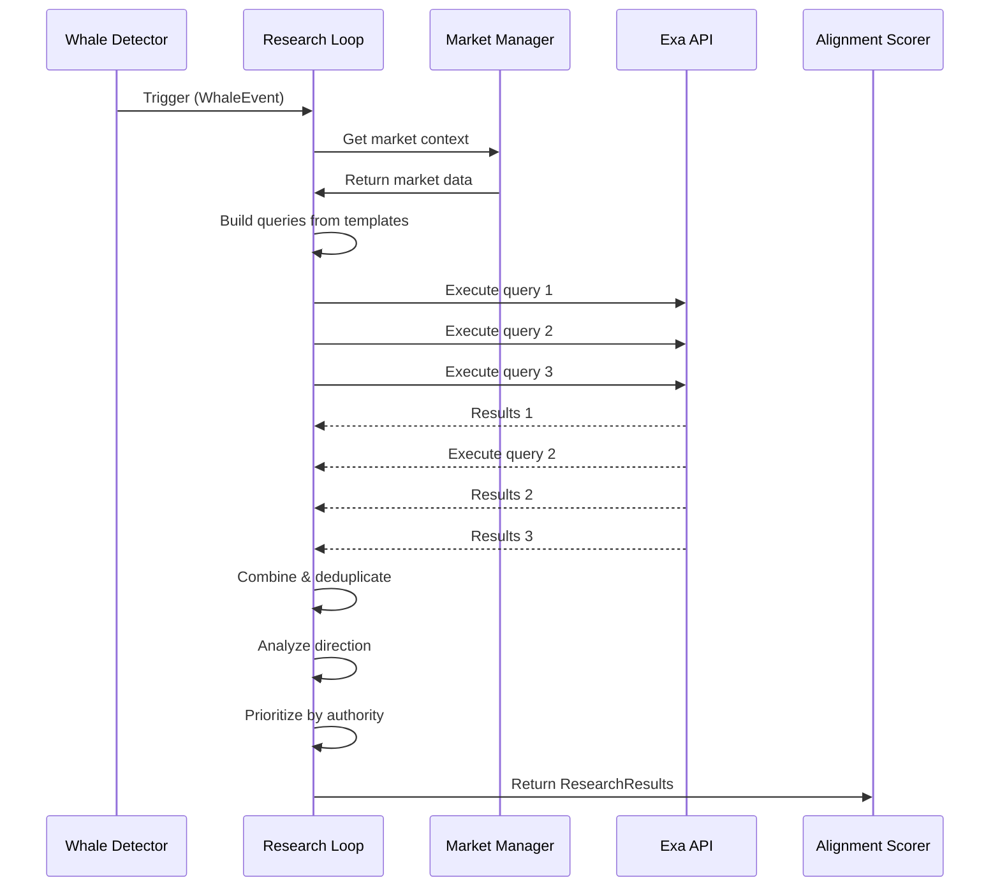
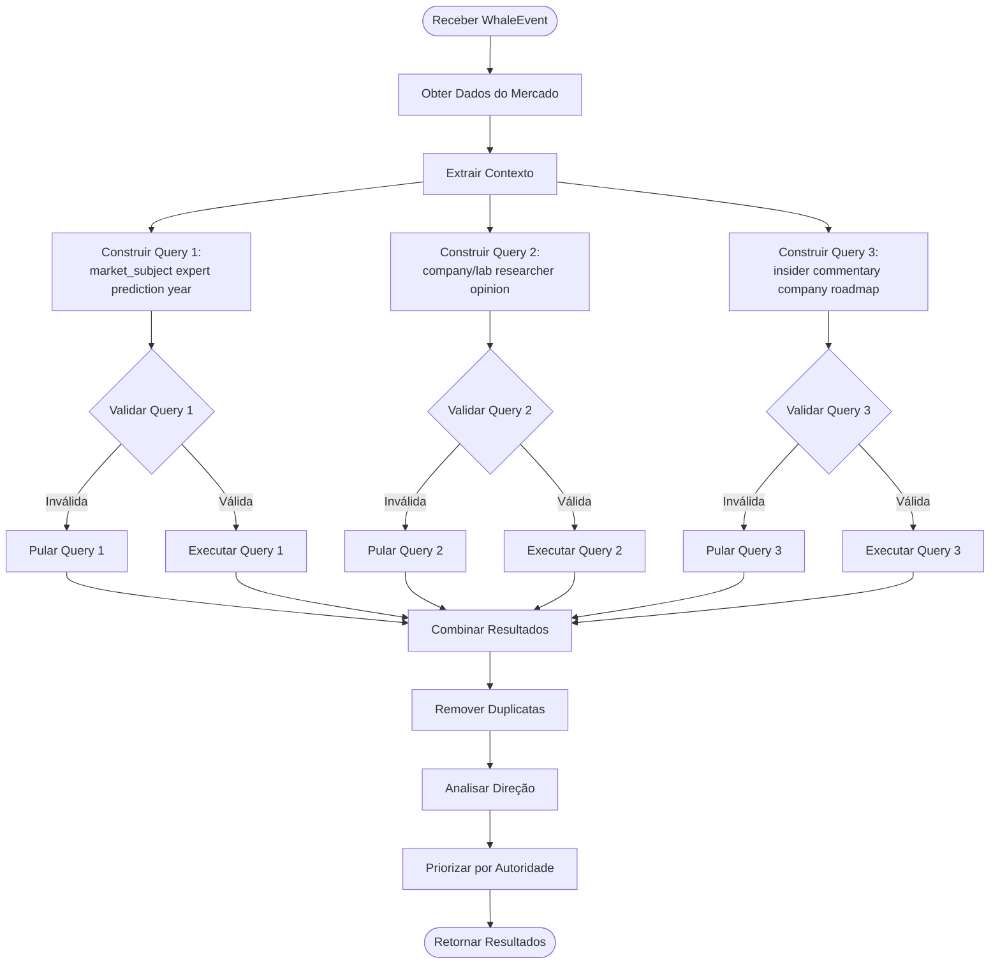
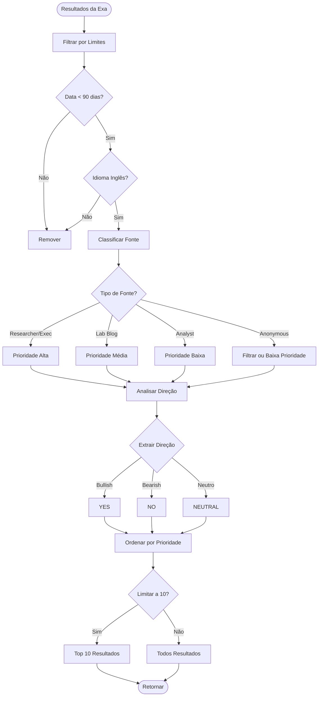

# PRD-03-Research-Loop

## 1. Visão Geral

O Research Loop é responsável por executar pesquisa em múltiplas fontes quando um evento de whale é detectado. O objetivo é encontrar sinais independentes de investigação que validem ou invalidem a direção da aposta do whale, priorizando fontes com autoridade (researchers, labs, executivos).

**Estratégia Híbrida:** Usar APIs gratuitas primeiro (NewsAPI, RSS, Reddit, ArXiv), e Exa API apenas como fallback quando necessário. Isso minimiza custos mantendo qualidade.

**Objetivo:** Obter pesquisa relevante e recente sobre o assunto do mercado para validar a direção da aposta do whale, minimizando custos.

**Contexto no produto:** Este componente é executado apenas após detecção de evento de whale válido. Os resultados são usados pelo Alignment Scorer para calcular o score de alinhamento.

**Dependências:**
- Whale Event Detector (dispara pesquisa)
- **APIs Gratuitas (obrigatórias):** NewsAPI, RSS Feeds, Reddit API, ArXiv API
- **Exa API (opcional):** Apenas como fallback quando APIs gratuitas não retornam resultados suficientes
- Market Manager (para contexto do mercado)

**⚠️ IMPORTANTE:** Para minimizar custos, sempre tentar APIs gratuitas primeiro. Usar Exa apenas se necessário.

## 2. Objetivos e Métricas

### Objetivos de Negócio
- Encontrar sinais independentes de investigação
- Priorizar fontes com autoridade
- Validar direção da aposta do whale

### Métricas de Sucesso
- Taxa de resultados relevantes: >70% dos resultados devem ser relevantes
- Cobertura de fontes autoritárias: >50% dos resultados de fontes autoritárias
- Tempo de execução: <15 segundos por pesquisa

### KPIs Específicos
- Número de resultados: máximo 10 por pesquisa
- Recência: apenas últimos 90 dias
- Idioma: apenas inglês
- Taxa de sucesso de queries: >95%

## 3. Requisitos Funcionais

### RF-001: Execução Condicional
O sistema deve executar pesquisa apenas quando evento de whale válido é detectado.

**Critérios:**
- Não executar pesquisa sem evento válido
- Não executar pesquisa duplicada para mesmo evento
- Verificar cache antes de executar pesquisa

### RF-001b: Cache de Pesquisas (Recomendado)
O sistema deve cachear resultados de pesquisa para eventos similares em mercados relacionados.

**Critérios:**
- Cache por 1-2 horas (TTL configurável)
- Chave de cache baseada em: market_id, direction, query_templates
- Para eventos similares em mercados relacionados, retornar do cache
- Economiza API calls e melhora velocidade (<20s decisão)
- Invalidar cache após TTL expirar

**Benefícios:**
- Reduz custos de API Exa
- Melhora performance (evita pesquisas duplicadas)
- Mantém consistência para eventos similares

### RF-002: Construção de Queries
O sistema deve construir queries usando templates fixos baseados no contexto do mercado.

**Templates:**
1. `"{market_subject} expert prediction {year}"`
2. `"{company/lab} researcher opinion future performance"`
3. `"insider commentary {company} AI roadmap"`

**Critérios:**
- Substituir placeholders com dados reais do mercado
- Adaptar queries baseado no tipo de mercado
- Validar queries antes de enviar

### RF-003: Execução de Queries em Múltiplas Fontes
O sistema deve executar queries em múltiplas fontes, priorizando APIs gratuitas.

**Estratégia Híbrida (Prioridades):**

**Fase 1 - APIs Gratuitas (Custo $0 - Implementar Agora):**
1. **NewsAPI** - Fonte principal
2. **RSS Expandido** - 15-20 feeds de qualidade (TechCrunch, OpenAI Blog, DeepMind, ArXiv, etc.)
3. **ArXiv API** - Papers acadêmicos
4. **Reddit API** - Comunidades técnicas (com User-Agent + delays para respeitar rate limits)

**Fase 2 - Exa API (Fallback Opcional - Após Validar Qualidade):**
- Usar Exa **apenas se:**
  - APIs gratuitas retornarem **<5 resultados** OU
  - Evento for **muito grande/importante** (ex: size >$50k, múltiplos whales)
- Ativado via config: `USE_EXA_FALLBACK=true`
- Monitorar quando Exa é usado (logging detalhado)

**Fase 3 - Análise e Decisão:**
- Analisar logs: qual % de casos precisou da Exa?
- **Se <20%:** Considerar remover Exa completamente, ficar 100% free
- Silêncio ainda mais valioso (menos dependências)

**Limites:**
- Máximo 10 resultados por query
- Período: últimos 90 dias (ou 7 dias para APIs gratuitas)
- Idioma: inglês apenas
- Priorizar fontes com autoridade

**Critérios:**
- Executar todas as queries do template
- Tentar APIs gratuitas primeiro (NewsAPI, RSS expandido, ArXiv, Reddit)
- RSS expandido: 15-20 feeds de qualidade (ver `RSS_FEEDS.md`)
- Reddit: usar User-Agent apropriado + delays entre requests
- Combinar resultados de múltiplas fontes
- Remover duplicatas
- **Regra para Exa:** Usar apenas se <5 resultados OU evento muito grande (>$50k)
- Logging detalhado de quando Exa é usado e por quê

### RF-004: Priorização de Fontes
O sistema deve priorizar fontes com autoridade.

**Hierarquia de fontes:**
1. Researchers / executivos nomeados (maior prioridade)
2. Blogs / entrevistas de laboratórios
3. Analistas / secondary sources
4. Anônimo / fórum (menor prioridade, pode filtrar)

**Critérios:**
- Identificar tipo de fonte quando possível
- Ordenar resultados por autoridade
- Filtrar fontes anônimas se necessário

### RF-005: Estruturação de Resultados
O sistema deve estruturar resultados da pesquisa em formato padronizado.

**Estrutura:**
```json
{
  "query": "original query",
  "results": [
    {
      "title": "...",
      "url": "...",
      "excerpt": "...",
      "author": "...",
      "source_type": "researcher" | "lab_blog" | "analyst" | "anonymous",
      "published_date": "2025-01-10",
      "relevance_score": 0.85,
      "direction": "YES" | "NO" | "NEUTRAL"
    }
  ],
  "total_results": 10,
  "execution_time_ms": 1250
}
```

### RF-006: Análise de Direção
O sistema deve tentar identificar direção implícita ou explícita de cada resultado.

**Critérios:**
- Analisar conteúdo para determinar se é bullish (YES), bearish (NO), ou neutro
- Usar análise simples de palavras-chave e contexto
- Marcar como NEUTRAL se direção não clara

### RF-007: Tratamento de Erros
O sistema deve tratar erros de API graciosamente.

**Critérios:**
- Retry com backoff exponencial para erros temporários
- Retornar resultados parciais se algumas queries falharem
- Logging detalhado de erros
- Não bloquear pipeline se pesquisa falhar completamente

## 4. Requisitos Não-Funcionais

### Performance
- Tempo total de pesquisa: <15 segundos
- Queries executadas em paralelo quando possível
- Cache de resultados (opcional, TTL curto)

### Confiabilidade
- Taxa de sucesso: >95%
- Tratamento robusto de rate limits
- Fallback graceful em caso de falha

### Segurança
- Validação de inputs antes de construir queries
- Sanitização de dados do mercado
- Não expor credenciais da API

### Escalabilidade
- Suporta múltiplas pesquisas simultâneas
- Respeita rate limits da Exa API
- Preparado para aumentar número de queries se necessário

## 5. User Stories

### US-001: Como Alignment Scorer, eu quero receber resultados estruturados de pesquisa
**Critérios de aceitação:**
- Resultados contêm todos os campos necessários
- Direção identificada quando possível
- Fonte classificada por autoridade

### US-002: Como sistema, eu quero executar pesquisa apenas quando necessário
**Critérios de aceitação:**
- Pesquisa não executa sem evento válido
- Não executa pesquisa duplicada
- Cache funciona corretamente (se implementado)

### US-003: Como sistema, eu quero priorizar fontes autoritárias
**Critérios de aceitação:**
- Resultados ordenados por autoridade
- Fontes anônimas filtradas ou depriorizadas
- Identificação de tipo de fonte funciona corretamente

## 6. Fluxos e Processos

### Fluxo de Pesquisa



### Construção de Queries



### Processamento de Resultados



## 7. Especificações Técnicas

### Estrutura de Dados

```python
@dataclass
class ResearchResult:
    title: str
    url: str
    excerpt: str
    author: Optional[str]
    source_type: str  # "researcher" | "lab_blog" | "analyst" | "anonymous"
    published_date: datetime
    relevance_score: float  # 0.0 - 1.0
    direction: str  # "YES" | "NO" | "NEUTRAL"
    query_used: str  # qual query gerou este resultado

@dataclass
class ResearchResults:
    market_id: str
    whale_event_id: str  # referência ao evento que gerou pesquisa
    queries_executed: List[str]
    results: List[ResearchResult]
    total_results: int
    execution_time_ms: int
    timestamp: datetime
    
    def get_by_direction(self, direction: str) -> List[ResearchResult]:
        """Filtra resultados por direção."""
        return [r for r in self.results if r.direction == direction]
    
    def get_by_source_type(self, source_type: str) -> List[ResearchResult]:
        """Filtra resultados por tipo de fonte."""
        return [r for r in self.results if r.source_type == source_type]
```

### Templates de Queries

```python
QUERY_TEMPLATES = [
    "{market_subject} expert prediction {year}",
    "{company_or_lab} researcher opinion future performance",
    "insider commentary {company_or_lab} AI roadmap"
]

def build_queries(market: Market, whale_event: WhaleEvent) -> List[str]:
    """Constrói queries baseadas em templates e contexto do mercado."""
    queries = []
    
    # Extrair contexto do mercado
    market_subject = extract_subject(market.market_name)
    year = extract_year(market.market_name) or "2025"
    company_or_lab = extract_company(market.market_name)
    
    # Construir queries
    for template in QUERY_TEMPLATES:
        query = template.format(
            market_subject=market_subject,
            year=year,
            company_or_lab=company_or_lab or market_subject
        )
        queries.append(query)
    
    return queries
```

### Sistema de Cache

```python
from datetime import datetime, timedelta
from typing import Optional, Dict, Any
import hashlib
import json

class ResearchCache:
    def __init__(self, ttl_hours: int = 2):
        """Inicializa cache com TTL de 1-2 horas."""
        self.cache: Dict[str, Dict[str, Any]] = {}
        self.ttl = timedelta(hours=ttl_hours)
    
    def _generate_key(
        self,
        market_id: str,
        direction: str,
        query_templates: list
    ) -> str:
        """Gera chave única baseada em mercado, direção e queries."""
        data = f"{market_id}:{direction}:{json.dumps(query_templates, sort_keys=True)}"
        return hashlib.md5(data.encode()).hexdigest()
    
    def get(
        self,
        market_id: str,
        direction: str,
        query_templates: list
    ) -> Optional[ResearchResults]:
        """Obtém resultado do cache se ainda válido."""
        key = self._generate_key(market_id, direction, query_templates)
        
        if key in self.cache:
            cached = self.cache[key]
            if datetime.now() - cached['timestamp'] < self.ttl:
                return cached['results']
            else:
                # Expirou, remover
                del self.cache[key]
        
        return None
    
    def set(
        self,
        market_id: str,
        direction: str,
        query_templates: list,
        results: ResearchResults
    ):
        """Armazena resultado no cache."""
        key = self._generate_key(market_id, direction, query_templates)
        self.cache[key] = {
            'results': results,
            'timestamp': datetime.now()
        }
    
    def clear_expired(self):
        """Remove entradas expiradas do cache."""
        now = datetime.now()
        expired_keys = [
            key for key, value in self.cache.items()
            if now - value['timestamp'] >= self.ttl
        ]
        for key in expired_keys:
            del self.cache[key]
```

### Interface da Classe ResearchLoop

```python
class ResearchLoop:
    def __init__(
        self,
        exa_api_key: str,
        market_manager: MarketManager,
        max_results: int = 10,
        max_age_days: int = 90,
        cache_ttl_hours: int = 2
    ):
        """Inicializa research loop com configurações."""
        self.cache = ResearchCache(ttl_hours=cache_ttl_hours)
        
    async def execute_research(
        self,
        whale_event: WhaleEvent
    ) -> ResearchResults:
        """Executa pesquisa para um evento de whale."""
        # Verificar cache primeiro
        market = self.market_manager.get_market_by_id(whale_event.market_id)
        queries = self._build_queries(market, whale_event)
        
        cached = self.cache.get(
            whale_event.market_id,
            whale_event.direction,
            queries
        )
        if cached:
            return cached
        
        # Se não em cache, executar pesquisa
        results = await self._execute_research_internal(whale_event, queries)
        
        # Armazenar no cache
        self.cache.set(
            whale_event.market_id,
            whale_event.direction,
            queries,
            results
        )
        
        return results
        
    async def _execute_query(
        self,
        query: str,
        max_results: int = 10
    ) -> List[Dict]:
        """Executa uma query na Exa API."""
        
    def _classify_source(self, result: Dict) -> str:
        """Classifica tipo de fonte do resultado."""
        
    def _analyze_direction(self, result: Dict) -> str:
        """Analisa direção implícita/explícita do resultado."""
        
    def _prioritize_results(
        self,
        results: List[ResearchResult]
    ) -> List[ResearchResult]:
        """Prioriza resultados por autoridade."""
```

### Integração com Exa API

```python
import exa_py

class ExaAPIClient:
    def __init__(self, api_key: str):
        self.client = exa_py.Exa(api_key=api_key)
    
    async def search(
        self,
        query: str,
        max_results: int = 10,
        start_published_date: Optional[str] = None,
        language: str = "en"
    ) -> List[Dict]:
        """Executa busca na Exa API."""
        try:
            response = self.client.search(
                query=query,
                num_results=max_results,
                start_published_date=start_published_date,
                language=language,
                use_autoprompt=True,  # melhorar queries automaticamente
                category="research"  # priorizar pesquisa acadêmica
            )
            return response.results
        except Exception as e:
            logger.error(f"Exa API error: {e}")
            raise
```

### Análise de Direção (Simples)

```python
BULLISH_KEYWORDS = [
    "bullish", "positive", "optimistic", "growth", "breakthrough",
    "leading", "dominant", "win", "success", "advance"
]

BEARISH_KEYWORDS = [
    "bearish", "negative", "pessimistic", "decline", "failure",
    "lagging", "struggle", "lose", "challenge", "risk"
]

def analyze_direction(result: Dict) -> str:
    """Analisa direção do resultado baseado em palavras-chave."""
    text = f"{result.get('title', '')} {result.get('excerpt', '')}".lower()
    
    bullish_count = sum(1 for kw in BULLISH_KEYWORDS if kw in text)
    bearish_count = sum(1 for kw in BEARISH_KEYWORDS if kw in text)
    
    if bullish_count > bearish_count + 1:
        return "YES"
    elif bearish_count > bullish_count + 1:
        return "NO"
    else:
        return "NEUTRAL"
```

## 8. Critérios de Aceitação

### Testes Funcionais

- [ ] Pesquisa executa apenas quando evento válido é detectado
- [ ] Queries são construídas corretamente dos templates
- [ ] Máximo 10 resultados retornados
- [ ] Apenas resultados dos últimos 90 dias
- [ ] Apenas resultados em inglês
- [ ] Fontes são classificadas corretamente
- [ ] Resultados são priorizados por autoridade
- [ ] Direção é analisada quando possível
- [ ] Duplicatas são removidas
- [ ] Estrutura de dados está correta

### Testes de Integração

- [ ] Integração com Exa API funciona corretamente
- [ ] Tratamento de rate limits funciona
- [ ] Retry logic funciona para erros temporários
- [ ] Resultados são passados corretamente para Alignment Scorer
- [ ] Erros não quebram pipeline

### Validações Específicas

- [ ] Performance: pesquisa completa <15 segundos
- [ ] Taxa de sucesso: >95%
- [ ] Resultados relevantes: >70%
- [ ] Fontes autoritárias: >50% dos resultados

## 9. Riscos e Dependências

### Riscos Técnicos

**Risco 1: Exa API Indisponível**
- **Impacto:** Alto - pesquisa não funciona
- **Mitigação:** Retry com backoff, fallback graceful, logging

**Risco 2: Rate Limits da Exa API**
- **Impacto:** Médio - pode limitar frequência de pesquisas
- **Mitigação:** Respeitar rate limits, implementar throttling, cache

**Risco 3: Queries Malformadas**
- **Impacto:** Médio - resultados irrelevantes
- **Mitigação:** Validação de queries, testes de templates, ajuste iterativo

**Risco 4: Resultados Irrelevantes**
- **Impacto:** Médio - afeta qualidade do score
- **Mitigação:** Usar autoprompt da Exa, filtrar por categoria, validar manualmente

**Risco 5: Análise de Direção Incorreta**
- **Impacto:** Médio - pode afetar score de alinhamento
- **Mitigação:** Algoritmo simples mas conservador, marcar NEUTRAL quando incerto

### Dependências Externas

1. **Exa API**
   - Acesso necessário para pesquisa semântica
   - Dependência crítica
   - Requer chave de API válida
   - Rate limits aplicáveis

2. **Market Manager**
   - Fornece contexto do mercado
   - Dependência crítica

### Mitigações

- Implementar health checks para Exa API
- Cache de resultados (TTL curto, opcional)
- Logging detalhado de queries e resultados
- Validação manual inicial de qualidade
- Ajuste iterativo de templates baseado em resultados

## 10. Notas de Implementação

### Considerações Técnicas

- **Async/Await:** Todas as chamadas de API devem ser assíncronas
- **Paralelismo:** Executar múltiplas queries em paralelo quando possível
- **Cache:** Considerar cache de resultados (TTL curto, ~1 hora)
- **Rate Limiting:** Respeitar rate limits da Exa API

### Decisões de Design

- **Templates Fixos:** Templates são fixos no MVP (não aprendem)
- **Máximo 10 Resultados:** Limite para manter processamento rápido
- **90 Dias:** Período escolhido para balancear recência e cobertura
- **Análise Simples:** Análise de direção é simples (palavras-chave), não ML

### Limitações Conhecidas

- **Sem ML:** Análise de direção é baseada em regras simples
- **Templates Fixos:** Não adaptam dinamicamente
- **Sem Persistência:** Resultados não são persistidos (apenas usados para score)
- **Idioma Fixo:** Apenas inglês (limitação da Exa ou escolha)

### Exemplo de Configuração

```python
RESEARCH_CONFIG = {
    "max_results": 10,
    "max_age_days": 90,
    "language": "en",
    "exa_category": "research",
    "use_autoprompt": True,
    "source_priority": {
        "researcher": 4,
        "lab_blog": 3,
        "analyst": 2,
        "anonymous": 1
    },
    "min_relevance_score": 0.5,
    "cache_ttl_seconds": 3600  # 1 hora
}
```

---

**Referências:**
- [PRD-00-Overview.md](PRD-00-Overview.md) - Visão geral do sistema
- [PRD-02-Whale-Event-Detection.md](PRD-02-Whale-Event-Detection.md) - Componente anterior
- [PRD-04-Alignment-Score.md](PRD-04-Alignment-Score.md) - Próximo componente
- [README.md](../../README.md) - Documento principal do projeto

