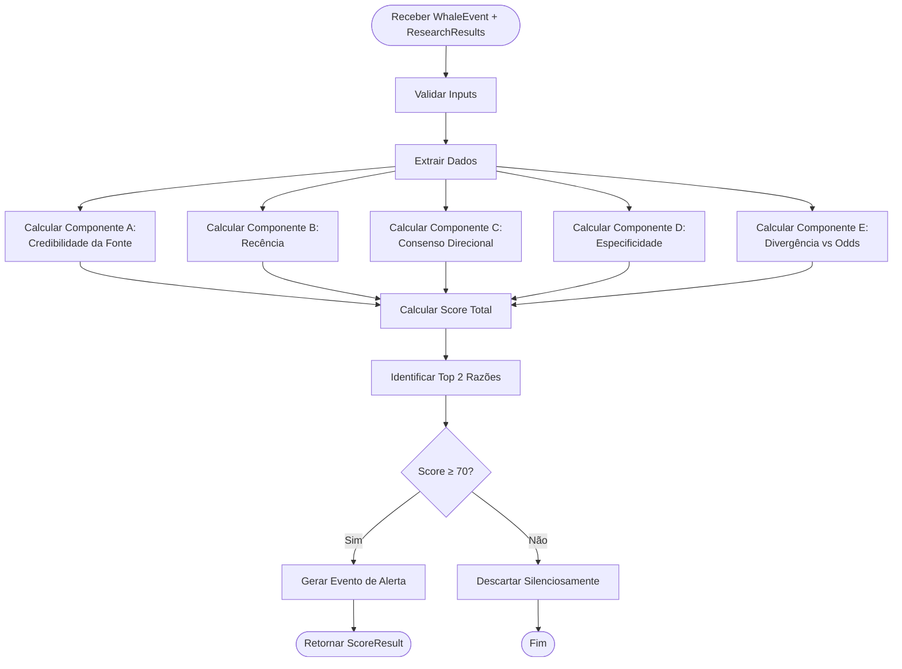
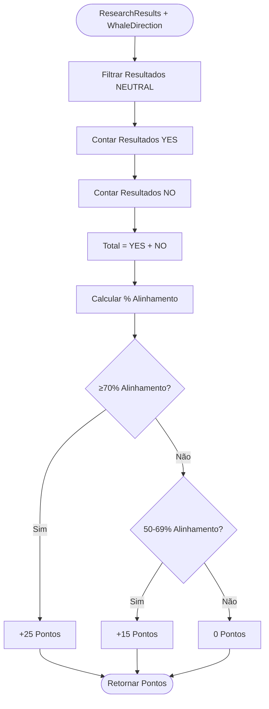
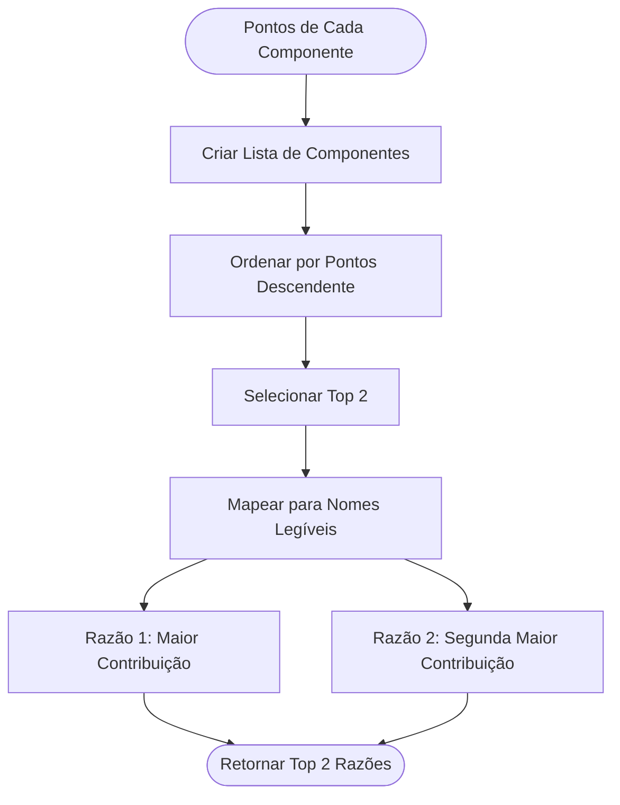

# PRD-04-Alignment-Score

## 1. Visão Geral

O sistema de Alignment Score calcula um score determinístico (0-100) que mede o alinhamento entre a direção da aposta do whale e os sinais independentes de investigação obtidos via pesquisa. O score é explicável e baseado em regras fixas, sem machine learning no MVP.

**Objetivo:** Determinar se um evento de whale tem suporte suficiente de pesquisa para gerar um alerta (threshold ≥ 70).

**Contexto no produto:** Este componente recebe dados do Whale Event Detector e Research Loop, calcula o score, e decide se deve gerar alerta.

**Dependências:**
- Whale Event Detector (fornece evento e direção)
- Research Loop (fornece resultados de pesquisa)
- Market Manager (para contexto adicional se necessário)

## 2. Objetivos e Métricas

### Objetivos de Negócio
- Filtrar eventos de whale com baixa confiança
- Garantir que apenas eventos com suporte de pesquisa geram alertas
- Manter score explicável (não "mágico")

### Métricas de Sucesso
- Taxa de eventos que passam threshold (≥70): 5-10% dos eventos detectados
- Score médio de alertas enviados: ≥75
- Explicabilidade: top 2 razões identificadas corretamente em 100% dos casos

### KPIs Específicos
- Tempo de cálculo: <1 segundo
- Precisão de identificação de top 2 razões: 100%
- Taxa de falsos positivos: <20% (validado manualmente)

## 3. Requisitos Funcionais

### RF-001: Cálculo de Score Total
O sistema deve calcular score total de 0-100 baseado em 5 componentes.

**Componentes:**
- A. Credibilidade da Fonte (0-30 pontos)
- B. Recência (0-20 pontos)
- C. Consenso Direcional (0-25 pontos)
- D. Especificidade (0-15 pontos)
- E. Divergência vs Odds (0-10 pontos)

**Critérios:**
- Score total = soma de todos os componentes
- Máximo possível: 100 pontos
- Mínimo possível: 0 pontos

### RF-002: Componente A - Credibilidade da Fonte
O sistema deve calcular pontos baseados na credibilidade das fontes de pesquisa.

**Pontuação:**
- Researcher / executivo nomeado: +30 pontos (máximo)
- Blog / entrevista de laboratório: +20 pontos
- Analista / secondary source: +10 pontos
- Anônimo / fórum: 0 pontos

**Critérios:**
- Usar média ponderada de todas as fontes
- Peso por número de resultados de cada tipo
- Máximo 30 pontos para este componente

### RF-003: Componente B - Recência
O sistema deve calcular pontos baseados na recência dos resultados de pesquisa.

**Pontuação:**
- ≤7 dias: +20 pontos
- 8-30 dias: +10 pontos
- 31-90 dias: +5 pontos
- >90 dias: 0 pontos (não deve acontecer, filtrado antes)

**Critérios:**
- Usar média ponderada de todas as datas
- Peso por relevância do resultado
- Máximo 20 pontos para este componente

### RF-004: Componente C - Consenso Direcional
O sistema deve calcular pontos baseados no consenso direcional dos resultados.

**Pontuação:**
- ≥70% das fontes alinham com direção do whale: +25 pontos
- 50-69% das fontes alinham: +15 pontos
- <50% das fontes alinham: 0 pontos

**Critérios:**
- Comparar direção dos resultados (YES/NO) com direção do whale
- Ignorar resultados NEUTRAL no cálculo
- Contar apenas resultados com direção clara

### RF-005: Componente D - Especificidade
O sistema deve calcular pontos baseados na especificidade das previsões.

**Pontuação:**
- Previsão explícita: +15 pontos
- Linguagem direcional forte: +8 pontos
- Vago: 0 pontos

**Critérios:**
- Analisar conteúdo dos resultados para determinar especificidade
- Previsão explícita = menciona mercado específico ou evento específico
- Linguagem direcional forte = afirmações claras sobre direção
- Vago = linguagem genérica ou ambígua

### RF-006: Componente E - Divergência vs Odds
O sistema deve calcular pontos baseados na divergência entre sentimento de pesquisa e odds do mercado.

**Pontuação:**
- ≥15% diferença: +10 pontos
- 5-14% diferença: +5 pontos
- <5% diferença: 0 pontos

**Critérios:**
- Calcular sentimento médio implícito dos resultados (percentual YES)
- Comparar com odds atuais do mercado
- Diferença = |sentimento_pesquisa - odds_mercado|

### RF-007: Identificação de Top 2 Razões
O sistema deve identificar as 2 razões que mais contribuíram para o score.

**Critérios:**
- Ordenar componentes por pontos contribuídos
- Selecionar top 2 componentes
- Armazenar para inclusão no alerta

### RF-008: Decisão de Alerta
O sistema deve decidir se score é suficiente para gerar alerta.

**Critérios:**
- Score ≥ 70: gerar alerta
- Score < 70: descartar silenciosamente
- Incluir score e top 2 razões no evento de alerta

## 4. Requisitos Não-Funcionais

### Performance
- Cálculo de score: <1 segundo
- Processamento assíncrono quando possível
- Cálculo determinístico (mesmos inputs = mesmo score)

### Confiabilidade
- Validação de inputs antes de calcular
- Tratamento de casos extremos (sem resultados, etc.)
- Logging detalhado de cálculos para debugging

### Segurança
- Validação de dados recebidos
- Sanitização de valores numéricos
- Prevenção de divisão por zero

### Escalabilidade
- Suporta múltiplos cálculos simultâneos
- Sem dependências de estado externo
- Preparado para aumentar complexidade se necessário

## 5. User Stories

### US-001: Como Alert Generator, eu quero receber score e top 2 razões
**Critérios de aceitação:**
- Score calculado corretamente (0-100)
- Top 2 razões identificadas corretamente
- Decisão de alerta baseada em threshold ≥70

### US-002: Como sistema, eu quero calcular score de forma explicável
**Critérios de aceitação:**
- Cada componente é calculado independentemente
- Pontos de cada componente são rastreáveis
- Top 2 razões refletem componentes com maior contribuição

### US-003: Como usuário final, eu quero entender por que recebi um alerta
**Critérios de aceitação:**
- Top 2 razões são claras e compreensíveis
- Score é incluído no alerta (opcional, para transparência)

## 6. Fluxos e Processos

### Fluxo de Cálculo de Score



### Cálculo de Consenso Direcional



### Identificação de Top 2 Razões



## 7. Especificações Técnicas

### Estrutura de Dados

```python
@dataclass
class ScoreComponents:
    credibility: float  # 0-30
    recency: float  # 0-20
    consensus: float  # 0-25
    specificity: float  # 0-15
    divergence: float  # 0-10
    
    @property
    def total(self) -> float:
        """Calcula score total."""
        return (
            self.credibility +
            self.recency +
            self.consensus +
            self.specificity +
            self.divergence
        )

@dataclass
class ScoreResult:
    whale_event: WhaleEvent
    research_results: ResearchResults
    score: float  # 0-100
    components: ScoreComponents
    top_2_reasons: List[str]
    should_alert: bool  # score >= 70
    timestamp: datetime
    
    def to_dict(self) -> Dict[str, Any]:
        """Converte resultado para dicionário."""
        return {
            "score": self.score,
            "components": {
                "credibility": self.components.credibility,
                "recency": self.components.recency,
                "consensus": self.components.consensus,
                "specificity": self.components.specificity,
                "divergence": self.components.divergence
            },
            "top_2_reasons": self.top_2_reasons,
            "should_alert": self.should_alert,
            "timestamp": self.timestamp.isoformat()
        }
```

### Interface da Classe AlignmentScorer

```python
class AlignmentScorer:
    def __init__(self, threshold: float = 70.0):
        """Inicializa scorer com threshold."""
        self.threshold = threshold
    
    def calculate_score(
        self,
        whale_event: WhaleEvent,
        research_results: ResearchResults
    ) -> ScoreResult:
        """Calcula score de alinhamento."""
        
    def _calculate_credibility(
        self,
        research_results: ResearchResults
    ) -> float:
        """Calcula componente A: Credibilidade da Fonte."""
        
    def _calculate_recency(
        self,
        research_results: ResearchResults
    ) -> float:
        """Calcula componente B: Recência."""
        
    def _calculate_consensus(
        self,
        whale_event: WhaleEvent,
        research_results: ResearchResults
    ) -> float:
        """Calcula componente C: Consenso Direcional."""
        
    def _calculate_specificity(
        self,
        research_results: ResearchResults
    ) -> float:
        """Calcula componente D: Especificidade."""
        
    def _calculate_divergence(
        self,
        whale_event: WhaleEvent,
        research_results: ResearchResults,
        market_odds: float
    ) -> float:
        """Calcula componente E: Divergência vs Odds."""
        
    def _identify_top_reasons(
        self,
        components: ScoreComponents
    ) -> List[str]:
        """Identifica top 2 razões do score."""
```

### Algoritmo de Cálculo Detalhado

```python
def calculate_score(
    self,
    whale_event: WhaleEvent,
    research_results: ResearchResults
) -> ScoreResult:
    """Calcula score completo de alinhamento."""
    
    # Validar inputs
    if not research_results.results:
        # Sem resultados = score 0
        return ScoreResult(
            whale_event=whale_event,
            research_results=research_results,
            score=0.0,
            components=ScoreComponents(0, 0, 0, 0, 0),
            top_2_reasons=[],
            should_alert=False,
            timestamp=datetime.now()
        )
    
    # Calcular cada componente
    credibility = self._calculate_credibility(research_results)
    recency = self._calculate_recency(research_results)
    consensus = self._calculate_consensus(whale_event, research_results)
    specificity = self._calculate_specificity(research_results)
    
    # Obter odds do mercado (precisa buscar)
    market_odds = self._get_market_odds(whale_event.market_id)
    divergence = self._calculate_divergence(
        whale_event,
        research_results,
        market_odds
    )
    
    # Criar componentes
    components = ScoreComponents(
        credibility=credibility,
        recency=recency,
        consensus=consensus,
        specificity=specificity,
        divergence=divergence
    )
    
    # Calcular score total
    score = components.total
    
    # Identificar top 2 razões
    top_2_reasons = self._identify_top_reasons(components)
    
    # Decidir se deve alertar
    should_alert = score >= self.threshold
    
    return ScoreResult(
        whale_event=whale_event,
        research_results=research_results,
        score=score,
        components=components,
        top_2_reasons=top_2_reasons,
        should_alert=should_alert,
        timestamp=datetime.now()
    )
```

### Cálculo de Credibilidade da Fonte

```python
def _calculate_credibility(
    self,
    research_results: ResearchResults
) -> float:
    """Calcula pontos de credibilidade (0-30)."""
    
    source_scores = {
        "researcher": 30,
        "lab_blog": 20,
        "analyst": 10,
        "anonymous": 0
    }
    
    if not research_results.results:
        return 0.0
    
    # Calcular média ponderada
    total_score = 0.0
    total_weight = 0
    
    for result in research_results.results:
        score = source_scores.get(result.source_type, 0)
        weight = result.relevance_score  # usar relevance como peso
        total_score += score * weight
        total_weight += weight
    
    if total_weight == 0:
        return 0.0
    
    # Normalizar para máximo de 30
    average_score = total_score / total_weight
    return min(30.0, average_score)
```

### Cálculo de Consenso Direcional

```python
def _calculate_consensus(
    self,
    whale_event: WhaleEvent,
    research_results: ResearchResults
) -> float:
    """Calcula pontos de consenso (0-25)."""
    
    # Filtrar resultados com direção clara
    directional_results = [
        r for r in research_results.results
        if r.direction != "NEUTRAL"
    ]
    
    if not directional_results:
        return 0.0
    
    # Contar alinhamento com direção do whale
    aligned = sum(
        1 for r in directional_results
        if r.direction == whale_event.direction
    )
    
    total = len(directional_results)
    alignment_percent = (aligned / total) * 100
    
    # Aplicar pontuação
    if alignment_percent >= 70:
        return 25.0
    elif alignment_percent >= 50:
        return 15.0
    else:
        return 0.0
```

### Identificação de Top 2 Razões

```python
REASON_NAMES = {
    "credibility": "High credibility sources (researchers, labs)",
    "recency": "Recent research findings",
    "consensus": "Strong directional consensus",
    "specificity": "Specific predictions",
    "divergence": "Significant divergence from market odds"
}

def _identify_top_reasons(
    self,
    components: ScoreComponents
) -> List[str]:
    """Identifica top 2 razões do score."""
    
    # Criar lista de (nome, pontos)
    component_scores = [
        ("credibility", components.credibility),
        ("recency", components.recency),
        ("consensus", components.consensus),
        ("specificity", components.specificity),
        ("divergence", components.divergence)
    ]
    
    # Ordenar por pontos descendente
    component_scores.sort(key=lambda x: x[1], reverse=True)
    
    # Selecionar top 2
    top_2 = component_scores[:2]
    
    # Mapear para nomes legíveis
    reasons = [REASON_NAMES.get(name, name) for name, _ in top_2]
    
    return reasons
```

## 8. Critérios de Aceitação

### Testes Funcionais

- [ ] Score total calculado corretamente (soma de componentes)
- [ ] Componente A (Credibilidade) calculado corretamente (0-30)
- [ ] Componente B (Recência) calculado corretamente (0-20)
- [ ] Componente C (Consenso) calculado corretamente (0-25)
- [ ] Componente D (Especificidade) calculado corretamente (0-15)
- [ ] Componente E (Divergência) calculado corretamente (0-10)
- [ ] Top 2 razões identificadas corretamente
- [ ] Decisão de alerta baseada em threshold ≥70
- [ ] Score 0 quando não há resultados de pesquisa
- [ ] Tratamento de casos extremos (todos NEUTRAL, etc.)

### Testes de Integração

- [ ] Integração com Whale Event Detector funciona
- [ ] Integração com Research Loop funciona
- [ ] ScoreResult passado corretamente para Alert Generator
- [ ] Validação de inputs funciona corretamente

### Validações Específicas

- [ ] Performance: cálculo <1 segundo
- [ ] Determinístico: mesmos inputs = mesmo score
- [ ] Explicável: top 2 razões refletem componentes com maior contribuição
- [ ] Score nunca excede 100 ou fica negativo

## 9. Riscos e Dependências

### Riscos Técnicos

**Risco 1: Cálculo de Consenso Incorreto**
- **Impacto:** Alto - pode afetar decisão de alerta
- **Mitigação:** Validação rigorosa de direções, testes unitários extensivos

**Risco 2: Análise de Especificidade Subjetiva**
- **Impacto:** Médio - pode variar entre implementações
- **Mitigação:** Regras claras e específicas, validação manual inicial

**Risco 3: Divergência vs Odds Requer Dados de Mercado**
- **Impacto:** Médio - componente pode não ser calculável se API falhar
- **Mitigação:** Fallback para 0 pontos se dados não disponíveis, não bloquear cálculo

**Risco 4: Top 2 Razões Não Refletem Realidade**
- **Impacto:** Baixo - não afeta funcionalidade, apenas UX
- **Mitigação:** Validação manual inicial, ajuste de mapeamento se necessário

### Dependências Externas

1. **Whale Event Detector**
   - Fornece evento e direção
   - Dependência crítica

2. **Research Loop**
   - Fornece resultados de pesquisa
   - Dependência crítica

3. **Market Manager / Polymarket API**
   - Para obter odds atuais (componente E)
   - Dependência opcional (pode fallback para 0)

### Mitigações

- Validação rigorosa de todos os inputs
- Testes unitários para cada componente
- Logging detalhado de cálculos para debugging
- Fallback graceful para componentes que dependem de dados externos

## 10. Notas de Implementação

### Considerações Técnicas

- **Determinístico:** Mesmos inputs sempre produzem mesmo score
- **Explicável:** Cada ponto pode ser rastreado até sua origem
- **Assíncrono:** Cálculo pode ser assíncrono se necessário
- **Stateless:** Não mantém estado entre cálculos

### Decisões de Design

- **Score Fixo:** Algoritmo não aprende/adapta no MVP
- **Threshold Fixo:** 70 é hardcoded (pode ser configurável por usuário depois)
- **Top 2 Razões:** Escolhido para balancear informação e simplicidade
- **Sem ML:** Por design, para manter explicabilidade

### Limitações Conhecidas

- **Análise Simples:** Especificidade e direção são baseadas em regras simples
- **Sem Aprendizado:** Score não melhora com o tempo
- **Threshold Fixo:** Não adapta dinamicamente
- **Componente E Opcional:** Pode não ser calculável se API falhar

### Exemplo de Configuração

```python
SCORER_CONFIG = {
    "threshold": 70.0,
    "component_weights": {
        "credibility": 30,
        "recency": 20,
        "consensus": 25,
        "specificity": 15,
        "divergence": 10
    },
    "consensus_thresholds": {
        "high": 0.70,  # ≥70% = 25 pontos
        "medium": 0.50  # 50-69% = 15 pontos
    },
    "divergence_thresholds": {
        "high": 0.15,  # ≥15% = 10 pontos
        "medium": 0.05  # 5-14% = 5 pontos
    }
}
```

---

**Referências:**
- [PRD-00-Overview.md](PRD-00-Overview.md) - Visão geral do sistema
- [PRD-02-Whale-Event-Detection.md](PRD-02-Whale-Event-Detection.md) - Fonte de eventos
- [PRD-03-Research-Loop.md](PRD-03-Research-Loop.md) - Fonte de pesquisa
- [PRD-05-Alert-Generation.md](PRD-05-Alert-Generation.md) - Próximo componente
- [README.md](../../README.md) - Documento principal do projeto

