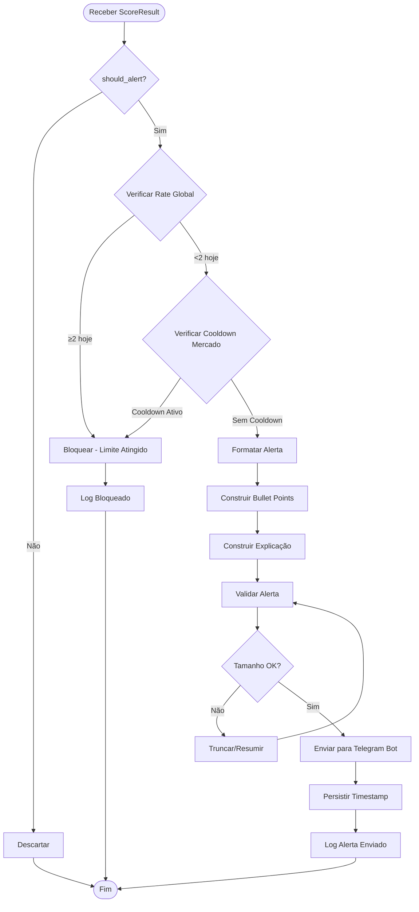
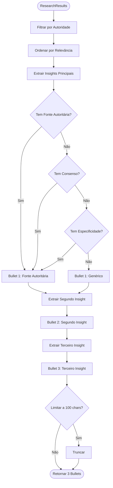
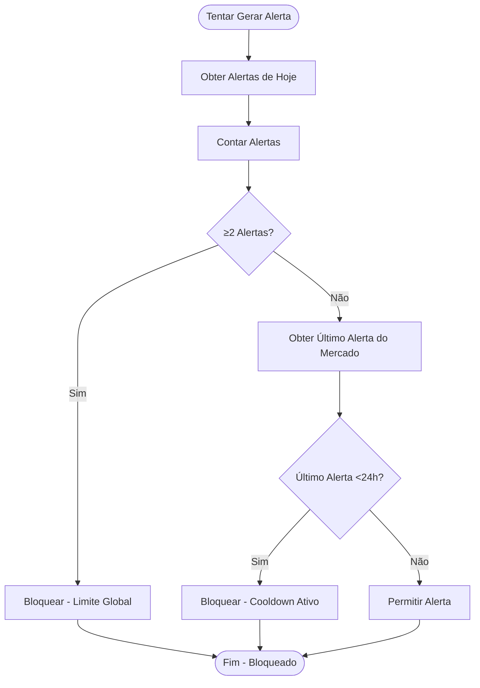

# PRD-05-Alert-Generation

## 1. Visão Geral

O sistema de geração de alertas é responsável por formatar e preparar alertas para entrega via Telegram, respeitando regras rigorosas de rate limiting. O alerta deve ser auto-explicativo e permitir decisão em <20 segundos.

**Objetivo:** Gerar alertas formatados que comunicam claramente o evento de whale, pesquisa de suporte, e por que o mercado pode estar mal precificado.

**Contexto no produto:** Este componente recebe ScoreResult do Alignment Scorer e gera alerta formatado para o Telegram Bot entregar.

**Dependências:**
- Alignment Scorer (fornece score e decisão)
- Market Manager (para contexto do mercado)
- Telegram Bot (para entrega)
- Sistema de rate limiting (para controle de frequência)

## 2. Objetivos e Métricas

### Objetivos de Negócio
- Comunicar alertas de forma clara e acionável
- Respeitar limites de rate para manter qualidade
- Permitir decisão rápida (<20 segundos)

### Métricas de Sucesso
- Tempo de leitura do alerta: <20 segundos
- Taxa de alertas enviados: ≤2 por dia
- Taxa de cooldown respeitada: 100% (24h por mercado)
- Formatação correta: 100% dos alertas seguem schema

### KPIs Específicos
- Tempo de geração: <500ms
- Tamanho da mensagem: <2000 caracteres (limite Telegram)
- Taxa de alertas por evento: <10% (alta seletividade)

## 3. Requisitos Funcionais

### RF-001: Geração Condicional
O sistema deve gerar alerta apenas quando ScoreResult indica `should_alert=True`.

**Critérios:**
- Não gerar alerta se score < 70
- Não gerar alerta se rate limits violados
- Não gerar alerta se cooldown ativo

### RF-002: Formatação do Alerta
O sistema deve formatar alerta conforme schema exato definido.

**Schema do alerta:**
```
🧠 ExaSignal — AI Market

Market:
{market_name}
{direction} @ {odds}%

Whale Event:
${size_usd}k new {direction} position
First entry in {days} days
~{liquidity_ratio}% of market liquidity

Research Signal:
• {bullet_point_1}
• {bullet_point_2}
• {bullet_point_3}

Why This Is Mispriced:
{explanation}

Confidence:
{confidence_level} ({top_2_reasons})

Note:
This is not consensus. This is filtered conviction.
```

### RF-003: Construção de Bullet Points
O sistema deve construir 3 bullet points resumindo pesquisa de suporte.

**Critérios:**
- Extrair insights principais dos resultados de pesquisa
- Priorizar fontes autoritárias
- Limitar a 3 bullet points mais relevantes
- Cada bullet point: máximo 100 caracteres

### RF-004: Explicação de Mispricing
O sistema deve explicar por que o mercado pode estar mal precificado.

**Critérios:**
- Comparar sentimento de pesquisa com odds do mercado
- Mencionar divergência específica (ex: "Expert sentiment implies ~80-85%, market at 68%")
- Formato claro e conciso

### RF-005: Rate Limiting Global
O sistema deve respeitar limite global de 2 alertas por dia.

**Critérios:**
- Contar alertas enviados nas últimas 24 horas
- Bloquear novo alerta se limite atingido
- Reset contador após 24 horas
- **Persistir em SQLite** para evitar perda em restarts

### RF-006: Cooldown por Mercado
O sistema deve respeitar cooldown de 24 horas por mercado.

**Critérios:**
- Rastrear último alerta por market_id
- Bloquear novo alerta para mesmo mercado se <24h desde último
- Permitir alerta após 24 horas
- **Persistir em SQLite** para manter estado entre restarts

### RF-007: Validação Pré-Envio
O sistema deve validar alerta antes de enviar.

**Critérios:**
- Verificar tamanho da mensagem (<2000 caracteres)
- Verificar formato correto
- Verificar rate limits (consultar banco de dados)
- Verificar cooldown (consultar banco de dados)

### RF-008: Persistência SQLite
O sistema deve persistir dados mínimos necessários em SQLite para rate limiting e cooldowns.

**Critérios:**
- Usar `aiosqlite` para acesso assíncrono
- Armazenar timestamp de alertas enviados
- Armazenar último alerta por mercado
- Armazenar settings por usuário (threshold personalizado)
- Limpar dados antigos automaticamente (>7 dias)
- Evitar perda de estado em restarts

## 4. Requisitos Não-Funcionais

### Performance
- Geração de alerta: <500ms
- Validação de rate limits: <50ms
- Formatação: <100ms

### Confiabilidade
- Validação rigorosa antes de enviar
- Tratamento de erros de formatação
- Logging de todos os alertas gerados (enviados ou não)

### Segurança
- Validação de dados antes de formatar
- Sanitização de texto (prevenir injection)
- Limites de tamanho de mensagem

### Escalabilidade
- Suporta múltiplas gerações simultâneas
- Persistência eficiente (apenas dados necessários)
- Preparado para aumentar limites se necessário

## 5. User Stories

### US-001: Como usuário, eu quero receber alertas claros e acionáveis
**Critérios de aceitação:**
- Alerta contém todas as informações necessárias
- Formato é fácil de ler e entender
- Decisão possível em <20 segundos

### US-002: Como usuário, eu quero receber no máximo 2 alertas por dia
**Critérios de aceitação:**
- Sistema respeita limite global de 2/dia
- Não recebo mais de 2 alertas em 24 horas
- Sistema não envia alertas duplicados

### US-003: Como usuário, eu quero entender por que recebi o alerta
**Critérios de aceitação:**
- Alerta explica top 2 razões do score
- Explicação de mispricing é clara
- Research signal é compreensível

## 6. Fluxos e Processos

### Fluxo de Geração de Alerta



### Construção de Bullet Points



### Verificação de Rate Limits



## 7. Especificações Técnicas

### Estrutura de Dados do Alerta

```python
@dataclass
class Alert:
    market_id: str
    market_name: str
    direction: str  # "YES" | "NO"
    odds: float  # porcentagem atual do mercado
    whale_event: WhaleEvent
    research_summary: List[str]  # 3 bullet points
    mispricing_explanation: str
    confidence_level: str  # "High" | "Medium" | "Low"
    top_2_reasons: List[str]
    score: float
    timestamp: datetime
    
    def format_message(self) -> str:
        """Formata alerta como mensagem Telegram."""
        message = f"""🧠 ExaSignal — AI Market

Market:
{self.market_name}
{self.direction} @ {self.odds:.0f}%

Whale Event:
${self.whale_event.size_usd/1000:.0f}k new {self.direction} position
First entry in {self.whale_event.wallet_age_days} days
~{self.whale_event.liquidity_ratio*100:.1f}% of market liquidity

Research Signal:
"""
        for bullet in self.research_summary:
            message += f"• {bullet}\n"
        
        message += f"""
Why This Is Mispriced:
{self.mispricing_explanation}

Confidence:
{self.confidence_level} ({', '.join(self.top_2_reasons)})

Note:
This is not consensus. This is filtered conviction."""
        
        return message
```

### Interface da Classe AlertGenerator

```python
class AlertGenerator:
    def __init__(
        self,
        market_manager: MarketManager,
        max_alerts_per_day: int = 2,
        cooldown_hours: int = 24
    ):
        """Inicializa gerador de alertas."""
        
    def generate_alert(
        self,
        score_result: ScoreResult
    ) -> Optional[Alert]:
        """Gera alerta se condições atendidas."""
        
    def _check_rate_limits(
        self,
        market_id: str
    ) -> Tuple[bool, str]:
        """Verifica rate limits. Retorna (allowed, reason)."""
        
    def _build_research_summary(
        self,
        research_results: ResearchResults
    ) -> List[str]:
        """Constrói 3 bullet points de pesquisa."""
        
    def _build_mispricing_explanation(
        self,
        whale_event: WhaleEvent,
        research_results: ResearchResults,
        market_odds: float
    ) -> str:
        """Constrói explicação de mispricing."""
        
    def _determine_confidence_level(
        self,
        score: float
    ) -> str:
        """Determina nível de confiança baseado no score."""
        
    def _persist_alert_sent(
        self,
        market_id: str,
        timestamp: datetime
    ):
        """Persiste timestamp de alerta enviado."""
```

### Construção de Research Summary

```python
def _build_research_summary(
    self,
    research_results: ResearchResults
) -> List[str]:
    """Constrói 3 bullet points resumindo pesquisa."""
    
    bullets = []
    
    # Priorizar resultados por autoridade e relevância
    sorted_results = sorted(
        research_results.results,
        key=lambda r: (
            self._source_priority(r.source_type),
            r.relevance_score
        ),
        reverse=True
    )
    
    # Extrair insights principais
    insights = []
    
    # Insight 1: Fonte autoritária com direção clara
    authoritative = [
        r for r in sorted_results
        if r.source_type in ["researcher", "lab_blog"]
        and r.direction != "NEUTRAL"
    ]
    if authoritative:
        count = len(authoritative)
        direction = authoritative[0].direction
        insights.append(
            f"{count} {'source' if count == 1 else 'sources'} "
            f"from {'researchers' if authoritative[0].source_type == 'researcher' else 'labs'} "
            f"{'bullish' if direction == 'YES' else 'bearish'}"
        )
    
    # Insight 2: Consenso direcional
    yes_count = sum(1 for r in research_results.results if r.direction == "YES")
    no_count = sum(1 for r in research_results.results if r.direction == "NO")
    total_directional = yes_count + no_count
    
    if total_directional > 0:
        consensus_percent = (max(yes_count, no_count) / total_directional) * 100
        if consensus_percent >= 70:
            insights.append(
                f"{consensus_percent:.0f}% consensus on direction"
            )
    
    # Insight 3: Recência ou especificidade
    recent = [
        r for r in sorted_results
        if (datetime.now() - r.published_date).days <= 7
    ]
    if recent:
        insights.append(f"{len(recent)} recent findings (last 7 days)")
    else:
        insights.append("Multiple expert sources analyzed")
    
    # Limitar a 3 e truncar se necessário
    bullets = insights[:3]
    bullets = [b[:100] for b in bullets]  # truncar a 100 chars
    
    # Garantir pelo menos 3 bullets (preencher se necessário)
    while len(bullets) < 3:
        bullets.append("Expert analysis supports direction")
    
    return bullets[:3]
```

### Construção de Mispricing Explanation

```python
def _build_mispricing_explanation(
    self,
    whale_event: WhaleEvent,
    research_results: ResearchResults,
    market_odds: float
) -> str:
    """Constrói explicação de mispricing."""
    
    # Calcular sentimento implícito da pesquisa
    directional_results = [
        r for r in research_results.results
        if r.direction != "NEUTRAL"
    ]
    
    if not directional_results:
        return "Research supports direction, market may be mispriced"
    
    yes_count = sum(1 for r in directional_results if r.direction == "YES")
    research_sentiment = (yes_count / len(directional_results)) * 100
    
    # Comparar com odds do mercado
    if whale_event.direction == "YES":
        market_sentiment = market_odds
    else:
        market_sentiment = 100 - market_odds
    
    divergence = abs(research_sentiment - market_sentiment)
    
    if divergence >= 15:
        return (
            f"Expert sentiment implies ~{research_sentiment:.0f}%, "
            f"market at {market_sentiment:.0f}%"
        )
    elif divergence >= 5:
        return (
            f"Research suggests {research_sentiment:.0f}%, "
            f"market pricing {market_sentiment:.0f}%"
        )
    else:
        return "Research aligns with whale direction, potential mispricing"
```

### Sistema de Rate Limiting com SQLite

```python
import aiosqlite
from datetime import datetime, timedelta

class RateLimiter:
    def __init__(self, db_path: str = "exasignal.db"):
        self.db_path = db_path
    
    async def init_db(self):
        """Inicializa tabelas do banco de dados."""
        async with aiosqlite.connect(self.db_path) as db:
            await db.execute("""
                CREATE TABLE IF NOT EXISTS alerts_sent (
                    id INTEGER PRIMARY KEY AUTOINCREMENT,
                    market_id TEXT NOT NULL,
                    timestamp DATETIME NOT NULL,
                    user_id INTEGER
                )
            """)
            await db.execute("""
                CREATE INDEX IF NOT EXISTS idx_market_timestamp 
                ON alerts_sent(market_id, timestamp)
            """)
            await db.execute("""
                CREATE INDEX IF NOT EXISTS idx_timestamp 
                ON alerts_sent(timestamp)
            """)
            await db.commit()
    
    async def can_send_alert(
        self,
        market_id: str
    ) -> Tuple[bool, str]:
        """Verifica se pode enviar alerta (consulta SQLite)."""
        
        now = datetime.now()
        yesterday = now - timedelta(days=1)
        
        async with aiosqlite.connect(self.db_path) as db:
            # Limite global: 2 por dia
            cursor = await db.execute("""
                SELECT COUNT(*) FROM alerts_sent
                WHERE timestamp > ?
            """, (yesterday.isoformat(),))
            result = await cursor.fetchone()
            today_count = result[0] if result else 0
            
            if today_count >= 2:
                return (False, "Global daily limit reached (2 alerts)")
            
            # Cooldown por mercado: 24 horas
            cursor = await db.execute("""
                SELECT MAX(timestamp) FROM alerts_sent
                WHERE market_id = ? AND timestamp > ?
            """, (market_id, yesterday.isoformat()))
            result = await cursor.fetchone()
            
            if result and result[0]:
                last_alert_str = result[0]
                last_alert = datetime.fromisoformat(last_alert_str)
                hours_since = (now - last_alert).total_seconds() / 3600
                
                if hours_since < 24:
                    remaining = 24 - hours_since
                    return (False, f"Market cooldown active ({remaining:.1f}h remaining)")
        
        return (True, "OK")
    
    async def record_alert_sent(
        self,
        market_id: str,
        timestamp: datetime,
        user_id: int = None
    ):
        """Registra alerta enviado no SQLite."""
        async with aiosqlite.connect(self.db_path) as db:
            await db.execute("""
                INSERT INTO alerts_sent (market_id, timestamp, user_id)
                VALUES (?, ?, ?)
            """, (market_id, timestamp.isoformat(), user_id))
            await db.commit()
        
        # Limpar dados antigos (>7 dias) periodicamente
        await self._cleanup_old_data()
    
    async def _cleanup_old_data(self):
        """Remove dados antigos (>7 dias)."""
        cutoff = datetime.now() - timedelta(days=7)
        async with aiosqlite.connect(self.db_path) as db:
            await db.execute("""
                DELETE FROM alerts_sent
                WHERE timestamp < ?
            """, (cutoff.isoformat(),))
            await db.commit()
```

## 8. Critérios de Aceitação

### Testes Funcionais

- [ ] Alerta gerado apenas quando score ≥ 70
- [ ] Alerta não gerado se rate limit global atingido (≥2 hoje)
- [ ] Alerta não gerado se cooldown ativo (<24h desde último)
- [ ] Formato do alerta segue schema exato
- [ ] 3 bullet points são gerados corretamente
- [ ] Explicação de mispricing é clara e relevante
- [ ] Nível de confiança determinado corretamente
- [ ] Tamanho da mensagem <2000 caracteres
- [ ] Timestamp persistido após envio
- [ ] Rate limits atualizados corretamente

### Testes de Integração

- [ ] Integração com Alignment Scorer funciona
- [ ] Integração com Telegram Bot funciona
- [ ] Persistência de rate limits funciona
- [ ] Validação pré-envio funciona corretamente

### Validações Específicas

- [ ] Performance: geração <500ms
- [ ] Formatação correta: 100% dos alertas seguem schema
- [ ] Rate limiting: 100% de compliance
- [ ] Tamanho: todos os alertas <2000 caracteres

## 9. Riscos e Dependências

### Riscos Técnicos

**Risco 1: Mensagem Muito Longa**
- **Impacto:** Médio - pode exceder limite do Telegram
- **Mitigação:** Validação de tamanho, truncamento inteligente, limite de 2000 chars

**Risco 2: Rate Limiting Não Funciona**
- **Impacto:** Alto - pode enviar muitos alertas
- **Mitigação:** Validação rigorosa, testes extensivos, logging de todos os envios

**Risco 3: Formatação Incorreta**
- **Impacto:** Médio - degrada UX
- **Mitigação:** Validação de formato, testes de formatação, schema bem definido

**Risco 4: Persistência Perdida em Restart**
- **Impacto:** Baixo - rate limits resetam (aceitável no MVP)
- **Mitigação:** Persistência opcional em arquivo/DB, aceitar reset no MVP

### Dependências Externas

1. **Alignment Scorer**
   - Fornece score e decisão
   - Dependência crítica

2. **Market Manager**
   - Fornece contexto do mercado
   - Dependência crítica

3. **Telegram Bot**
   - Para entrega do alerta
   - Dependência crítica

### Mitigações

- Validação rigorosa antes de enviar
- Logging detalhado de todos os alertas
- Testes extensivos de formatação
- Monitoramento de rate limits

## 10. Notas de Implementação

### Considerações Técnicas

- **Formatação:** Usar template string ou formatação manual
- **Rate Limiting:** Pode ser em memória no MVP (reset em restart)
- **Persistência:** Mínima necessária (apenas timestamps)
- **Validação:** Sempre validar antes de enviar

### Decisões de Design

- **Schema Fixo:** Formato do alerta é fixo e bem definido
- **3 Bullet Points:** Balance entre informação e brevidade
- **Rate Limits Rígidos:** 2/dia global, 24h por mercado (hard limits)
- **Sem Personalização:** Formato é fixo no MVP (pode vir depois)

### Limitações Conhecidas

- **Persistência Mínima:** Rate limits podem resetar em restart (aceitável MVP)
- **Formato Fixo:** Não há personalização de formato
- **Sem A/B Testing:** Formato não é testado (pode vir depois)
- **Idioma Fixo:** Apenas inglês no MVP

### Exemplo de Alerta Gerado

```
🧠 ExaSignal — AI Market

Market:
Best AI Model by End of 2025
YES @ 68%

Whale Event:
$25k new YES position
First entry in 21 days
~3.1% of market liquidity

Research Signal:
• 3 sources from researchers bullish
• 75% consensus on direction
• 5 recent findings (last 7 days)

Why This Is Mispriced:
Expert sentiment implies ~82%, market at 68%

Confidence:
High (Strong directional consensus, High credibility sources)

Note:
This is not consensus. This is filtered conviction.
```

---

**Referências:**
- [PRD-00-Overview.md](PRD-00-Overview.md) - Visão geral do sistema
- [PRD-04-Alignment-Score.md](PRD-04-Alignment-Score.md) - Fonte de score
- [PRD-06-Telegram-Bot.md](PRD-06-Telegram-Bot.md) - Próximo componente
- [README.md](../../README.md) - Documento principal do projeto

