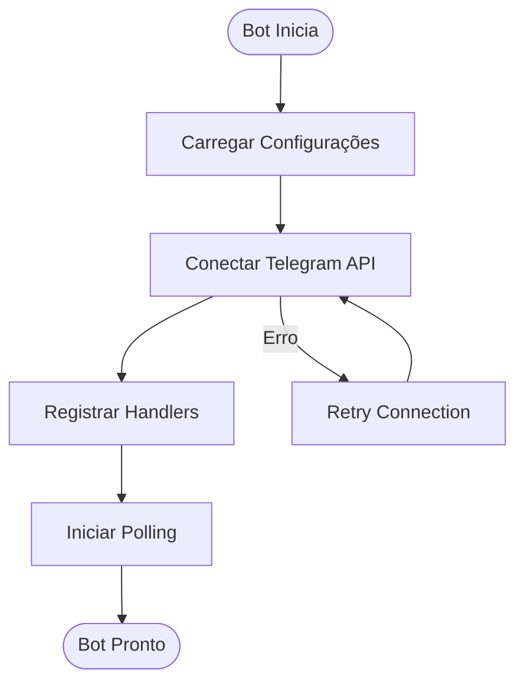
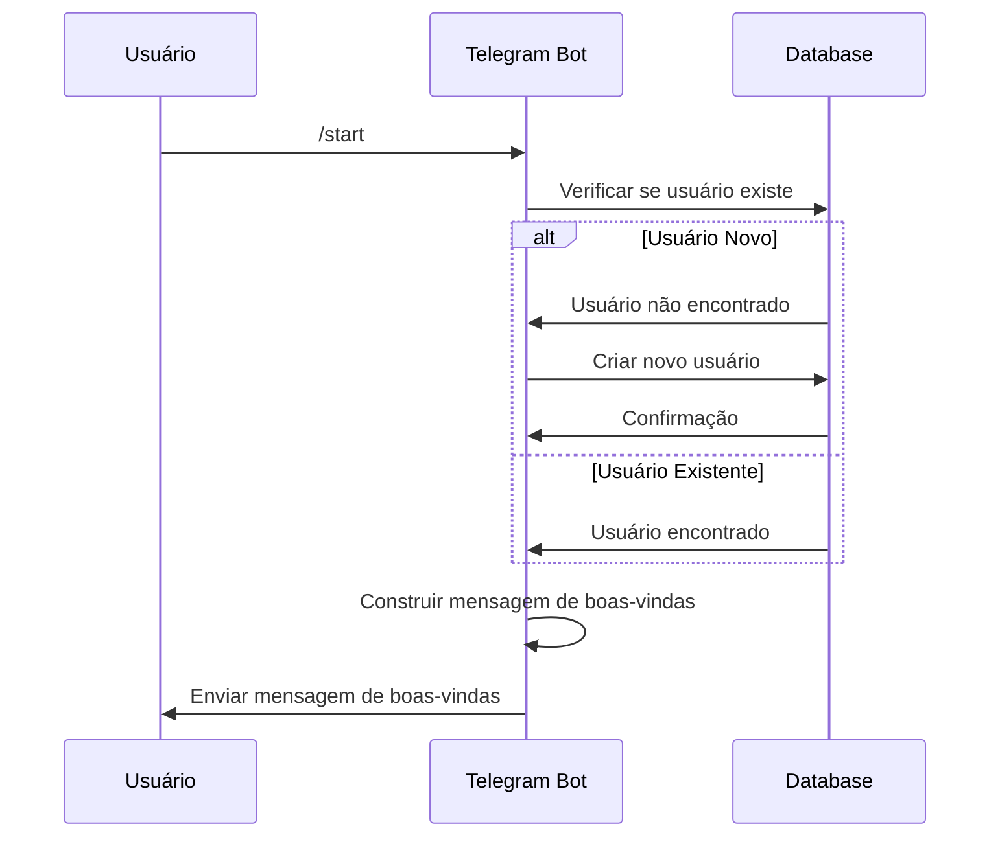
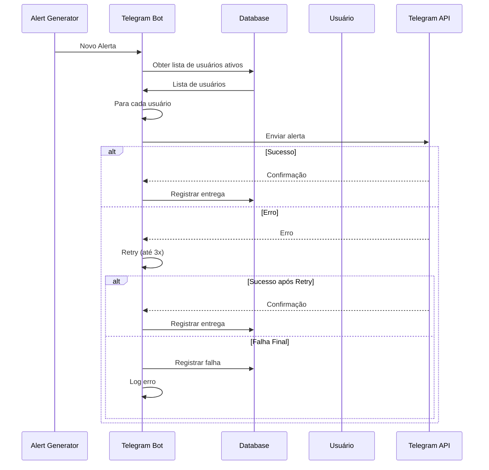
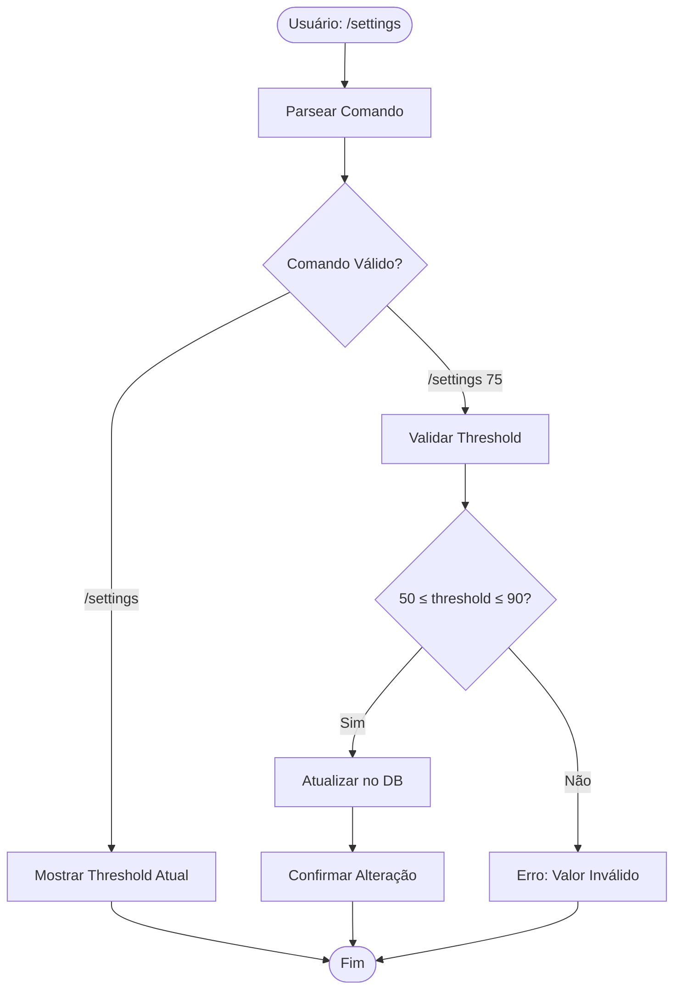

# PRD-06-Telegram-Bot

## 1. Visão Geral

O Telegram Bot é a interface única do usuário no MVP do ExaSignal. É responsável por receber comandos dos usuários, entregar alertas gerados pelo sistema, e gerenciar configurações básicas de usuário.

**Objetivo:** Fornecer interface simples e eficiente para usuários receberem alertas e interagirem com o sistema.

**Contexto no produto:** Este é o único canal de comunicação com usuários no MVP. Todos os alertas são entregues via este bot.

**Dependências:**
- Alert Generator (fornece alertas formatados)
- Market Manager (para comando /markets)
- Sistema de persistência (para configurações de usuário)

## 2. Objetivos e Métricas

### Objetivos de Negócio
- Entregar alertas de forma confiável
- Fornecer interface simples e intuitiva
- Permitir configuração básica de preferências

### Métricas de Sucesso
- Taxa de entrega de alertas: >99%
- Tempo de resposta a comandos: <2 segundos
- Taxa de erro: <1%
- Satisfação do usuário: interface clara e fácil de usar

### KPIs Específicos
- Latência de entrega de alerta: <5 segundos
- Taxa de sucesso de comandos: >99%
- Uptime do bot: >95%

## 3. Requisitos Funcionais

### RF-001: Comando /start
O sistema deve responder ao comando /start com mensagem de boas-vindas.

**Critérios:**
- Mensagem de boas-vindas clara e informativa
- Explicar o que é o ExaSignal
- Listar comandos disponíveis
- Registrar usuário no sistema (se novo)

### RF-002: Comando /markets
O sistema deve listar todos os mercados monitorados.

**Critérios:**
- Listar nome de cada mercado
- Mostrar odds atuais (se disponível)
- Formato legível e organizado
- Atualizar odds em tempo real (ou cache recente)

### RF-003: Comando /status
O sistema deve mostrar status do sistema e estatísticas básicas.

**Critérios:**
- Status do sistema (online/offline)
- Número de mercados monitorados
- Último alerta enviado (timestamp)
- Estatísticas básicas (opcional)

### RF-004: Comando /settings
O sistema deve permitir configurar threshold mínimo de score.

**Critérios:**
- Mostrar threshold atual
- Permitir alterar threshold (padrão: 70)
- Validar threshold (mínimo: 50, máximo: 90)
- Persistir configuração por usuário

### RF-005: Entrega de Alertas
O sistema deve entregar alertas gerados pelo Alert Generator.

**Critérios:**
- Enviar alerta formatado conforme schema
- Tratamento de erros de entrega (retry)
- Logging de todas as entregas
- Notificar usuário se entrega falhar (opcional)

### RF-006: Gestão de Usuários
O sistema deve gerenciar usuários e suas configurações.

**Critérios:**
- Registrar novos usuários automaticamente
- Armazenar configurações por usuário
- Suportar múltiplos usuários simultaneamente
- Limpar dados de usuários inativos (>90 dias)

### RF-007: Tratamento de Erros
O sistema deve tratar erros graciosamente.

**Critérios:**
- Mensagens de erro claras e úteis
- Não expor detalhes técnicos ao usuário
- Logging detalhado para debugging
- Recuperação automática quando possível

### RF-008: Rate Limiting de Comandos
O sistema deve limitar frequência de comandos por usuário.

**Critérios:**
- Prevenir spam de comandos
- Limite: máximo 10 comandos por minuto por usuário
- Mensagem educativa quando limite excedido
- Não bloquear usuários legítimos

### RF-009: Health Checks
O sistema deve fornecer comando /health para verificar status de componentes.

**Critérios:**
- Verificar conexão com Telegram API
- Verificar conexão com Exa API
- Verificar conexão com Polymarket APIs (Gamma, CLOB)
- Verificar status do banco de dados (SQLite)
- Retornar status claro de cada componente
- Útil para debugging e monitoramento

### RF-010: Logging e Monitoring
O sistema deve implementar logging estruturado e error tracking.

**Critérios:**
- Usar structlog para logging estruturado
- Capturar erros de APIs externas com Sentry
- Logging detalhado de todas as operações importantes
- Não expor informações sensíveis nos logs

## 4. Requisitos Não-Funcionais

### Performance
- Resposta a comandos: <2 segundos
- Entrega de alertas: <5 segundos após geração
- Suporta até 100 usuários simultâneos

### Confiabilidade
- Taxa de entrega: >99%
- Tratamento robusto de erros
- Retry logic para falhas temporárias
- Health checks periódicos

### Segurança
- Validação de inputs de usuário
- Sanitização de mensagens
- Rate limiting para prevenir abuse
- Não expor informações sensíveis

### Escalabilidade
- Suporta crescimento de usuários
- Preparado para múltiplos workers se necessário
- Persistência eficiente de configurações

## 5. User Stories

### US-001: Como usuário novo, eu quero entender como usar o bot
**Critérios de aceitação:**
- Comando /start explica o sistema claramente
- Lista de comandos é apresentada
- Instruções são fáceis de seguir

### US-002: Como usuário, eu quero ver quais mercados estão sendo monitorados
**Critérios de aceitação:**
- Comando /markets lista todos os mercados
- Informação é atualizada e precisa
- Formato é legível

### US-003: Como usuário, eu quero ajustar meu threshold de score
**Critérios de aceitação:**
- Comando /settings permite alterar threshold
- Validação clara de valores aceitos
- Configuração é persistida

### US-004: Como usuário, eu quero receber alertas de forma confiável
**Critérios de aceitação:**
- Alertas são entregues sem falhas
- Formato é consistente e legível
- Não recebo alertas duplicados

## 6. Fluxos e Processos

### Fluxo de Inicialização do Bot



### Fluxo de Comando /start



### Fluxo de Entrega de Alerta



### Fluxo de Comando /settings



## 7. Especificações Técnicas

### Estrutura de Dados de Usuário

```python
@dataclass
class User:
    user_id: int  # Telegram user ID
    username: Optional[str]
    first_name: Optional[str]
    threshold: float  # score threshold mínimo
    created_at: datetime
    last_active: datetime
    is_active: bool
    
    def to_dict(self) -> Dict[str, Any]:
        """Converte usuário para dicionário."""
        return {
            "user_id": self.user_id,
            "username": self.username,
            "first_name": self.first_name,
            "threshold": self.threshold,
            "created_at": self.created_at.isoformat(),
            "last_active": self.last_active.isoformat(),
            "is_active": self.is_active
        }
```

### Interface da Classe TelegramBot

```python
class TelegramBot:
    def __init__(
        self,
        token: str,
        alert_generator: AlertGenerator,
        market_manager: MarketManager
    ):
        """Inicializa bot com dependências."""
        
    async def start(self):
        """Inicia bot e registra handlers."""
        
    async def handle_start(self, update: Update, context: ContextTypes.DEFAULT_TYPE):
        """Handler para comando /start."""
        
    async def handle_markets(self, update: Update, context: ContextTypes.DEFAULT_TYPE):
        """Handler para comando /markets."""
        
    async def handle_status(self, update: Update, context: ContextTypes.DEFAULT_TYPE):
        """Handler para comando /status."""
        
    async def handle_settings(self, update: Update, context: ContextTypes.DEFAULT_TYPE):
        """Handler para comando /settings."""
        
    async def send_alert(self, alert: Alert, user_id: int) -> bool:
        """Envia alerta para usuário específico."""
        
    async def broadcast_alert(self, alert: Alert) -> Dict[int, bool]:
        """Envia alerta para todos os usuários ativos."""
        
    def _get_or_create_user(self, user_id: int) -> User:
        """Obtém ou cria usuário."""
        
    def _update_user_threshold(self, user_id: int, threshold: float) -> bool:
        """Atualiza threshold do usuário."""
```

### Implementação com python-telegram-bot

```python
from telegram import Update
from telegram.ext import Application, CommandHandler, ContextTypes
import asyncio

class TelegramBot:
    def __init__(
        self,
        token: str,
        alert_generator: AlertGenerator,
        market_manager: MarketManager,
        user_db: UserDatabase
    ):
        self.token = token
        self.alert_generator = alert_generator
        self.market_manager = market_manager
        self.user_db = user_db
        self.application = Application.builder().token(token).build()
        
    async def start(self):
        """Inicia bot e registra handlers."""
        # Registrar handlers
        self.application.add_handler(CommandHandler("start", self.handle_start))
        self.application.add_handler(CommandHandler("markets", self.handle_markets))
        self.application.add_handler(CommandHandler("status", self.handle_status))
        self.application.add_handler(CommandHandler("settings", self.handle_settings))
        self.application.add_handler(CommandHandler("health", self.handle_health))
        
        # Iniciar bot
        await self.application.initialize()
        await self.application.start()
        await self.application.updater.start_polling()
        
    async def handle_start(self, update: Update, context: ContextTypes.DEFAULT_TYPE):
        """Handler para comando /start."""
        user_id = update.effective_user.id
        
        # Obter ou criar usuário
        user = self._get_or_create_user(user_id)
        
        # Construir mensagem de boas-vindas
        message = f"""🧠 Welcome to ExaSignal!

ExaSignal is a conviction engine for AI/frontier tech markets on Polymarket. We only send alerts when:
• A whale event with real conviction occurs
• Research independently validates the direction

Commands:
/markets - List monitored markets
/status - System status
/settings - Configure your score threshold (current: {user.threshold})

Remember: Silence > Spam. We only alert when confidence is high."""
        
        await update.message.reply_text(message)
        
    async def handle_markets(self, update: Update, context: ContextTypes.DEFAULT_TYPE):
        """Handler para comando /markets."""
        markets = self.market_manager.get_all_markets()
        
        message = "📊 Monitored Markets:\n\n"
        for market in markets:
            # Obter odds atuais (se disponível)
            odds = self._get_market_odds(market.market_id)
            odds_str = f" @ {odds:.0f}%" if odds else ""
            message += f"• {market.market_name}{odds_str}\n"
        
        await update.message.reply_text(message)
        
    async def handle_status(self, update: Update, context: ContextTypes.DEFAULT_TYPE):
        """Handler para comando /status."""
        markets = self.market_manager.get_all_markets()
        last_alert = self._get_last_alert_time()
        
        message = f"""📈 System Status

Status: Online
Markets Monitored: {len(markets)}
Last Alert: {last_alert.strftime('%Y-%m-%d %H:%M:%S') if last_alert else 'None yet'}

System is running normally."""
        
        await update.message.reply_text(message)
        
    async def handle_settings(self, update: Update, context: ContextTypes.DEFAULT_TYPE):
        """Handler para comando /settings."""
        user_id = update.effective_user.id
        user = self._get_or_create_user(user_id)
        
        # Parsear comando
        args = context.args
        
        if not args:
            # Mostrar threshold atual
            message = f"⚙️ Your Settings\n\nScore Threshold: {user.threshold}\n\nTo change, use: /settings <threshold>\n(Valid range: 50-90)"
            await update.message.reply_text(message)
            return
        
        # Tentar atualizar threshold
        try:
            new_threshold = float(args[0])
            
            if new_threshold < 50 or new_threshold > 90:
                await update.message.reply_text(
                    "❌ Invalid threshold. Please use a value between 50 and 90."
                )
                return
            
            # Atualizar
            success = self._update_user_threshold(user_id, new_threshold)
            
            if success:
                await update.message.reply_text(
                    f"✅ Threshold updated to {new_threshold}"
                )
            else:
                await update.message.reply_text(
                    "❌ Failed to update threshold. Please try again."
                )
        except ValueError:
            await update.message.reply_text(
                "❌ Invalid format. Please use: /settings <number>"
            )
    
    async def handle_health(self, update: Update, context: ContextTypes.DEFAULT_TYPE):
        """Handler para comando /health."""
        checks = {
            "telegram": await self._check_telegram(),
            "exa_api": await self._check_exa(),
            "polymarket_gamma": await self._check_polymarket_gamma(),
            "polymarket_clob": await self._check_polymarket_clob(),
            "database": await self._check_database()
        }
        
        status = "✅ Healthy" if all(checks.values()) else "⚠️ Issues"
        message = f"🏥 Health Status: {status}\n\n"
        
        for service, healthy in checks.items():
            emoji = "✅" if healthy else "❌"
            message += f"{emoji} {service.replace('_', ' ').title()}\n"
        
        await update.message.reply_text(message)
    
    async def _check_telegram(self) -> bool:
        """Verifica conexão com Telegram API."""
        try:
            await self.application.bot.get_me()
            return True
        except:
            return False
    
    async def _check_exa(self) -> bool:
        """Verifica conexão com Exa API."""
        try:
            # Teste simples
            # Implementar conforme necessário
            return True
        except:
            return False
    
    async def _check_polymarket_gamma(self) -> bool:
        """Verifica conexão com Gamma API."""
        try:
            # Teste simples
            # Implementar conforme necessário
            return True
        except:
            return False
    
    async def _check_polymarket_clob(self) -> bool:
        """Verifica conexão com CLOB API."""
        try:
            # Teste simples
            # Implementar conforme necessário
            return True
        except:
            return False
    
    async def _check_database(self) -> bool:
        """Verifica conexão com banco de dados."""
        try:
            # Teste simples de conexão SQLite
            # Implementar conforme necessário
            return True
        except:
            return False
    
    async def broadcast_alert(self, alert: Alert) -> Dict[int, bool]:
        """Envia alerta para todos os usuários ativos."""
        users = self.user_db.get_active_users()
        results = {}
        
        for user in users:
            # Verificar threshold do usuário
            if alert.score < user.threshold:
                results[user.user_id] = False
                continue
            
            # Enviar alerta
            success = await self.send_alert(alert, user.user_id)
            results[user.user_id] = success
        
        return results
    
    async def send_alert(self, alert: Alert, user_id: int) -> bool:
        """Envia alerta para usuário específico."""
        try:
            message = alert.format_message()
            await self.application.bot.send_message(
                chat_id=user_id,
                text=message,
                parse_mode="Markdown"  # se usar formatação
            )
            return True
        except Exception as e:
            logger.error(f"Failed to send alert to {user_id}: {e}")
            return False
```

### Sistema de Rate Limiting de Comandos

```python
from collections import defaultdict
from datetime import datetime, timedelta

class CommandRateLimiter:
    def __init__(self, max_commands: int = 10, window_seconds: int = 60):
        self.max_commands = max_commands
        self.window_seconds = window_seconds
        self.user_commands: Dict[int, List[datetime]] = defaultdict(list)
    
    def can_execute_command(self, user_id: int) -> Tuple[bool, str]:
        """Verifica se usuário pode executar comando."""
        now = datetime.now()
        
        # Obter comandos recentes do usuário
        recent_commands = [
            cmd_time for cmd_time in self.user_commands[user_id]
            if (now - cmd_time).total_seconds() < self.window_seconds
        ]
        
        # Atualizar lista
        self.user_commands[user_id] = recent_commands
        
        # Verificar limite
        if len(recent_commands) >= self.max_commands:
            return (False, f"Rate limit exceeded. Max {self.max_commands} commands per minute.")
        
        # Registrar comando
        self.user_commands[user_id].append(now)
        
        return (True, "OK")
```

### Logging Estruturado e Error Tracking

```python
import structlog
import sentry_sdk

# Configurar structlog
structlog.configure(
    processors=[
        structlog.stdlib.filter_by_level,
        structlog.stdlib.add_logger_name,
        structlog.stdlib.add_log_level,
        structlog.stdlib.PositionalArgumentsFormatter(),
        structlog.processors.TimeStamper(fmt="iso"),
        structlog.processors.StackInfoRenderer(),
        structlog.processors.format_exc_info,
        structlog.processors.UnicodeDecoder(),
        structlog.processors.JSONRenderer()
    ],
    context_class=dict,
    logger_factory=structlog.stdlib.LoggerFactory(),
    wrapper_class=structlog.stdlib.BoundLogger,
    cache_logger_on_first_use=True,
)

logger = structlog.get_logger()

# Configurar Sentry para erros de APIs externas
sentry_sdk.init(
    dsn="your-sentry-dsn",  # Opcional
    traces_sample_rate=1.0,
    environment="production"  # ou "development"
)

# Uso no código
async def send_alert(self, alert: Alert, user_id: int) -> bool:
    """Envia alerta com logging estruturado."""
    logger.info(
        "sending_alert",
        user_id=user_id,
        market_id=alert.market_id,
        score=alert.score
    )
    
    try:
        await self.application.bot.send_message(
            chat_id=user_id,
            text=alert.format_message()
        )
        logger.info("alert_sent_successfully", user_id=user_id)
        return True
    except Exception as e:
        logger.error(
            "alert_send_failed",
            user_id=user_id,
            error=str(e),
            exc_info=True
        )
        # Capturar no Sentry
        sentry_sdk.capture_exception(e)
        return False
```

## 8. Critérios de Aceitação

### Testes Funcionais

- [ ] Comando /start funciona corretamente
- [ ] Comando /markets lista todos os mercados
- [ ] Comando /status mostra status correto
- [ ] Comando /settings mostra threshold atual
- [ ] Comando /settings permite alterar threshold
- [ ] Validação de threshold funciona (50-90)
- [ ] Alertas são entregues corretamente
- [ ] Usuários são criados automaticamente
- [ ] Configurações são persistidas
- [ ] Rate limiting de comandos funciona

### Testes de Integração

- [ ] Integração com Alert Generator funciona
- [ ] Integração com Market Manager funciona
- [ ] Integração com Telegram API funciona
- [ ] Tratamento de erros funciona corretamente
- [ ] Retry logic funciona para falhas temporárias

### Validações Específicas

- [ ] Performance: resposta a comandos <2 segundos
- [ ] Taxa de entrega: >99%
- [ ] Uptime: >95%
- [ ] Rate limiting: previne spam efetivamente

## 9. Riscos e Dependências

### Riscos Técnicos

**Risco 1: Telegram API Indisponível**
- **Impacto:** Alto - bot para de funcionar
- **Mitigação:** Retry logic, health checks, logging

**Risco 2: Rate Limits da Telegram API**
- **Impacto:** Médio - pode limitar entrega de alertas
- **Mitigação:** Respeitar rate limits, implementar queue se necessário

**Risco 3: Falha na Entrega de Alertas**
- **Impacto:** Alto - usuários não recebem alertas
- **Mitigação:** Retry logic, logging, notificação de falhas

**Risco 4: Perda de Configurações de Usuário**
- **Impacto:** Médio - usuários perdem preferências
- **Mitigação:** Persistência confiável, backup periódico

### Dependências Externas

1. **Telegram Bot API**
   - Acesso necessário para funcionamento
   - Dependência crítica
   - Requer bot token válido

2. **Alert Generator**
   - Fornece alertas para entrega
   - Dependência crítica

3. **Market Manager**
   - Fornece lista de mercados
   - Dependência crítica

4. **Sistema de Persistência**
   - Para configurações de usuário
   - Dependência crítica

### Mitigações

- Implementar health checks
- Retry logic robusto
- Logging detalhado
- Monitoramento de uptime
- Backup de configurações

## 10. Notas de Implementação

### Considerações Técnicas

- **Async/Await:** Todas as operações devem ser assíncronas
- **Error Handling:** Tratamento robusto de erros
- **Logging:** Logging detalhado para debugging
- **Persistência:** Configurações devem ser persistidas

### Decisões de Design

- **python-telegram-bot:** Biblioteca escolhida para MVP
- **Comandos Simples:** Apenas 4 comandos básicos no MVP
- **Sem Webhooks:** Polling é mais simples para MVP
- **Configuração Mínima:** Apenas threshold configurável

### Limitações Conhecidas

- **Polling:** Usa polling ao invés de webhooks (pode mudar depois)
- **Sem Grupos:** Apenas chats privados no MVP
- **Sem Admin:** Sem comandos administrativos no MVP
- **Idioma Fixo:** Apenas inglês no MVP

### Exemplo de Mensagens

**Mensagem de Boas-Vindas:**
```
🧠 Welcome to ExaSignal!

ExaSignal is a conviction engine for AI/frontier tech markets on Polymarket. We only send alerts when:
• A whale event with real conviction occurs
• Research independently validates the direction

Commands:
/markets - List monitored markets
/status - System status
/settings - Configure your score threshold (current: 70)

Remember: Silence > Spam. We only alert when confidence is high.
```

**Lista de Mercados:**
```
📊 Monitored Markets:

• Best AI Model by End of 2025 @ 68%
• OpenAI vs Google vs Anthropic Outcomes @ 45%
• First AGI Claim @ 12%
...
```

**Status:**
```
📈 System Status

Status: Online
Markets Monitored: 12
Last Alert: 2025-01-15 10:30:00

System is running normally.
```

---

**Referências:**
- [PRD-00-Overview.md](PRD-00-Overview.md) - Visão geral do sistema
- [PRD-05-Alert-Generation.md](PRD-05-Alert-Generation.md) - Fonte de alertas
- [README.md](../../README.md) - Documento principal do projeto

